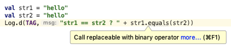
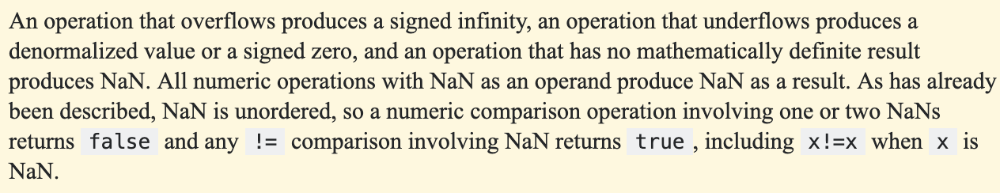

- Kotlin `==` 和 `equals` 是等价的，如果你写 `equals` 方法，编译器总是提示你可以换成 `==`：
- 

- 但是如果你写成这样，你会发现 `==` 返回结果是 false，而如果写成 `equals` ，结果却是 true：
- ````
// NaN 的产生方式：double NaN = 0.0d / 0.0;
val d1 = Double.NaN
val d2 = Double.NaN
Log.d(TAG,"d1 == d2 ? " + (d1 == d2)) // false
Log.d(TAG,"d1 == d2 ? " + (d1.equals(d2))) // true
- 看一下 kotlin 编译后生成的 Java 代码：
- d1 == d2 编译后还是 d1 == d2，而 d1.equals(d2) 编译后却是 Double.valueOf(d1).equals(d2))
- 对于两个 NaN 比较，Jvm 里有明确的说明，两个 NaN 比较就是返回 false：
- 

- 但是通过 Double.equals 就不一样了，它的方法内部实现如下：
- ````
public boolean equals(Object obj) {
    return (obj instanceof Double)
            && (doubleToLongBits(((Double)obj).value) ==
                    doubleToLongBits(value));
}
- 它先把 double 转成 long 类型，然后才比较大小，而那个 Double.NaN 转换完以后竟然是：9221120237041090560
- 成功的把 Not a Number 转换成一个 Number 了...