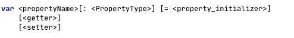

- 看 Kotlin 文档说它没有字段，只有属性，一个完整带属性定义是
- 
- 其中 initializer/getter/setter 都是可选带，类型也可以推导出来所有一般的写法就是
- `val a = 123` 这样
- 但是有时候需要用到属性，比如这种操作
```
var counter = 0
set(value) {
if (value >= 0) field = value
}
```
- 这是重写了 属性 counter 的 set 方法
- 里面那句 field = value 中的 field 叫：Backing Fields 幕后属性
- 这里如果直接用 counter = value 就会又调用到 set 方法，进入死循环了
- 所以 Kotlin 提供了一个幕后字段 field，避免这种问题，
- 所以字段的意思是不是直接指针操作？