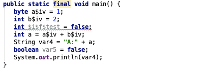
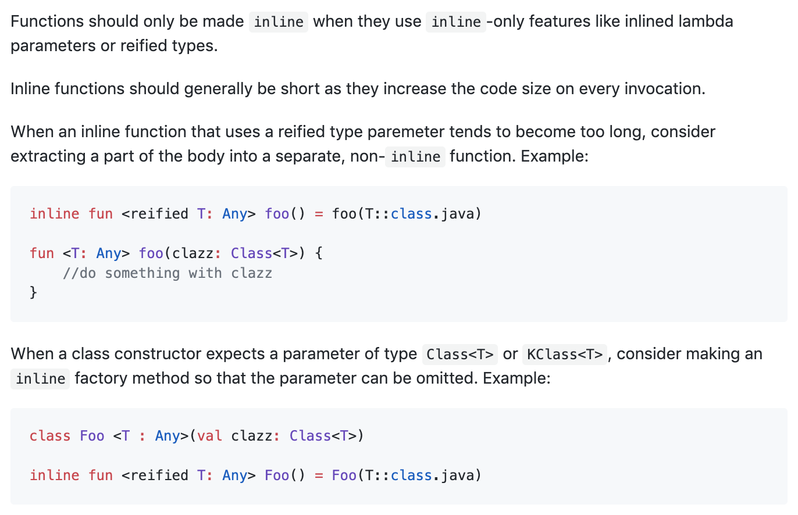

- 在看 Kotlin 协程相关代码时有很多方法使用 inline 关键字修饰，
- 使用 inline 修饰的方法会变成内联函数，调用内联函数时编译器把整个方法体内容复制到调用的地方，
- 目的是减少方法调用过程，提高执行效率
- 比如写一个 test 方法，然后在 main 中调用
````
inline fun test(a:Int,b:Int):Int{
    return a + b
}
fun main() {
    val a = test(1,2)
    println("A:$a")
}
````
- 编译后的代码是：
  
- 可以看到编译器把 test 方法中的内容都复制到 main 方法执行了
- 那这样就有一个问题，如果有 100 个调用的地方，就会复制 100 份代码，容易造成
- 代码膨胀，所以官方给的建议是，inline 关键字应该只用在 inline 特征的地方，比如下面提到的两种情况
- 反正就是能不用就别用，别给自己找麻烦
  
