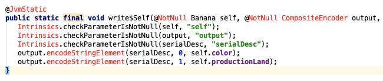
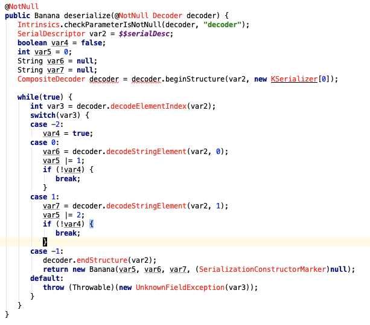

Kotlin 在 1.3.30 版本带来了几个比较好的新功能，其中一个是 Json 序列化，比 Gson 还好用，真佩服 Kotlin 团队这帮人。

> Kotlinx.Json 和 Gson 最大的不同是后者使用反射解析，而前者是动态生成代码，所以速度上应该前者更快

Json 在 Kotlin 是以插件的方式存在的，所以需要自己添加依赖，项目地址：[Kotlinx.serialization](https://github.com/Kotlin/kotlinx.serialization)

Json 用法和 JavaScript 很像：

````
// 首先定义一个类，要使用 Json，必须给该类添加 Serializable 注解
@Serializable
data class Banana(val color:String,
                  val productionLand:String)

// 先定义一个对象
val banana = Banana("#FFFF00","中国")
// 注解后的 Banana 对象会被动态插入一些代码
// 调用 Json.stringify 就能解析
val bananaJson = Json.stringify(Banana.serializer(),banana)
// parse 是反序列化，用法基本一样
val bananaObj = Json.parse(Banana.serializer(),bananaJson)
println("BananaObj:$bananaObj")
// 比 Gson 强大的一点是对数组的使用也非常简单
// 再也不用写那个冗长的 TypeToken 了
val bananaList = mutableListOf<Banana>()
bananaList.add(Banana(("#FF0000"),"越南"))
bananaList.add(Banana(("#00FF00"),"台湾"))
bananaList.add(Banana(("#0000FF"),"中国"))
// 只需要在 Banana.serializer() 后面在加一个 .list 即可
val bananaListJson = Json.stringify(Banana.serializer().list,bananaList)
println("BananaListJson:$bananaListJson")
// 反向序列化也一样
println("BananaList:${Json.parse(Banana.serializer().list,bananaListJson)}")
````


序列化的过程是这样的：
`Json.stringrify -> StreamingJsonOutput.encode -> Banana.serialize -> Banana.write$Seff -> StreamingJsonOutput.encodeStringElement`

所以实际序列化的过程还是在 Banana 对象内，我觉得这是它最大的特点，把序列化过程交给对象自己做是最合适的。



反序列化的过程类似，不过要稍微复杂点
`Json.parse -> StreamingJsonInput.decode -> Banana.deserialize`
下面是关键的反序列化过程


### 速度对比

| 行为 | 元素个数 | 次数 | Gson 耗时 | Ktolinx.Json 耗时 |
|-|-|-|-|-|
| 序列化 | 1000*1000 | 1 | 955ms | 875ms |
| 反序列化 | 1000*1000 | 1 | 889ms | 937ms |
| 序列化 | 1 | 100000 | 285ms | 257ms |
| 反序列化 | 1 | 100000  | 359ms | 158ms |
| 序列化（每次 new Gson） | 1 | 100000 | 4116ms | 295 ms |
| 反序列化（每次 new Gson） | 1 | 100000  | 2625ms | 347ms |


分析：
- 第一个测试：
    -  Gson 反射主要耗时的地方是遍历对象的属性，而每次序列化过程只需要遍历一次，所以反射的耗时可以忽略
- 第二个测试：
    - 执行 100000 次序列化和反序列化，但是时间还是相差无几，看了一下源码，Gson 这货居然缓存了对象的属性，所以其实也只执行了一次反射遍历
- 第三个猜测：
    - 每次都 new Gson 后造成缓存失效，于是瞬间拉开差距（为了测试的准确性，单独测试了 new Gson 时间消耗，大概占实际耗时的 1/10）
