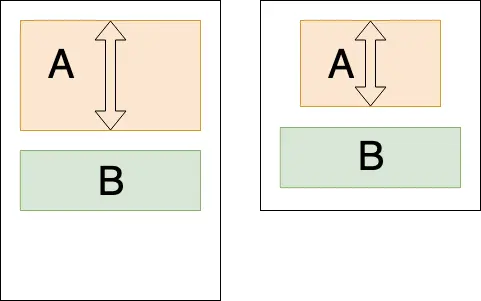

项目地址：[GitHub](https://github.com/goyourfly/ShrinkLinearLayout)
经常能碰到这样一种需求：

  - 1. A 和 B 依次排开，B 必须紧贴着 A 的底部，这个好做，用线性排列就可以
  - 2. 在小屏幕上如果空间不足则 A 等比例缩小，B 不能缩小，这个也好做，用 RelativeLayout 让 A 相对于 B 的上方显示

但是要同时满足这两条要求就很麻烦，只能自己写个自定义布局处理，思路是这样的：
  0. 首先，给子 View 加标记：`shirk` 0 代表不缩放，值越大缩放速度越快，如果有多个要缩放的子 View 则按照 shirk 比例分配缩放量
  1. 然后在开始测量时先计算子 View 整体高度和，如果高度和小于父亲的高度，则不用处理
  2. 如果高度大于父亲的高度，则算出需要缩小的量 `overflowSize = 子 View 高度和 - 父 View 高度`，按照比例分配给子 View，比如子 View A, B, C 的 shirk 分别为 1,2,3，他们的高度和超出父 View 的高度为 overflowsSize，他们应该缩小的量是：
    - A = overflowSize * 1 / 6
    - B = overflowSize * 2 / 6
    - C = overflowSize * 3 / 6
但是还有个问题，如果 C 的高度小于 overflowSize * 3 / 6，则要继续给 A 和 B 分配剩余的高度，直到把 overflowSize 分配完，所以这里要用递归处理
另外还要处理 View 之间的 margin 和 水平还是垂直的 LinearLayout
最终效果请查看 [GitHub](https://github.com/goyourfly/ShrinkLinearLayout)