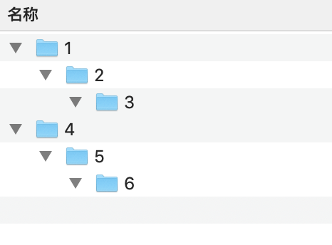

文件列表展示的目录格式如下：

按照面向对象的思维，文件夹与子文件夹的应该是嵌套关系
````
[{ 
    "path":"1",
    "subDir":[{
       "path":"2",
       "subDir":[{
            "path":"3",
            "subDir":[]
        }]
    }]
},{ 
    "path":"4",
    "subDir":[{
       "path":"5",
       "subDir":[{
            "path":"6",
            "subDir":[]
        }]
    }]
}]
````

但是 UI 显示时只有一个列表显示，不能直接给列表一个嵌套的数据，所以喂给列表的数据应该是这样拍扁的：
````
[{ 
    "path":"1",
    "subLevel":0,
},{ 
    "path":"2",
    "subLevel":1,
},{ 
    "path":"3",
    "subLevel":2,
},{ 
    "path":"4",
    "subLevel":0,
},{ 
    "path":"5",
    "subLevel":1,
},{ 
    "path":"6",
    "subLevel":2,
},]
````
通过 subLevel 表示它缩进多少，
由于业务数据是上面第一种格式，所以就涉及到两种数据格式转化的问题

嵌套数据拍扁过程比较简单，穷尽它所有的子数据就能拍扁，代码如下：

````
data class File(val path:String, val subDir:MutableList<File>)
data class UiFile(val subLevel:Int, val path:String)
// 拍扁数据
fun flatFiles(uiFiles: MutableList<UiFile>,
                files: List<File>,
                subLevel: Int){
    if(files.isEmpty()){
        return
    }
    files.forEach {
        uiFiles.add(UiFile(subLevel,it.path))
        // 先存储当前文件夹，再往下寻找
        flatFiles(uiFiles,it.subDir,subLevel + 1)
    }
}
````

但是从拍扁的数据反向转化为嵌套数据就感觉很麻烦
最开始想用多个嵌套的 while 循环，读取当前 subLevel 数据，如果有下一个 level，再开始一个 while 循环，调试了几次放弃了，后来想到一个投机取巧的办法：
````
val files = mutableListOf<File>()
list.forEach {
    if(it.subLevel == 0){
        files.add(File(it.path, mutableListOf()))
    }
    if(it.subLevel == 1){
        files.last().subDir.add(File(it.path, mutableListOf()))
    }
    if(it.subLevel == 2){
        files.last().subDir.last().subDir.add(File(it.path, mutableListOf()))
    }
}
````
这样虽然能实现，但是最多 3 层嵌套，而且感觉写的很烂，理想的方式还是递归实现

````
/**
 * 嵌套数据
 */
fun nestFiles(uiFiles: MutableList<UiFile>,
              files: MutableList<File>,
              subLevel: Int){
    var subFilesCursor = files;
    while(uiFiles.isNotEmpty()){
        val uiFile = uiFiles.get(0)
        if(uiFile.subLevel == subLevel){
            // 同等级，直接插入
            val subFiles = mutableListOf<File>()
            subFilesCursor = subFiles
            files.add(File(uiFile.path,subFiles))
            // 删掉已被消耗的 Item
            uiFiles.removeAt(0)
        }else if(uiFile.subLevel > subLevel){
            // 如果是子文件夹，则递归往下走，
            // 注意这里要一级一级往下走，不能跳级
            nestFiles(uiFiles,subFilesCursor,subLevel + 1)
        }else{
            // 如果小于当前 Level，跳出递归
            break
        }
    }
}
````
写到这里时突然发现，这不就是把列表转化为树的过程吗？😢😢😢
