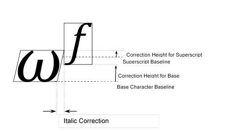
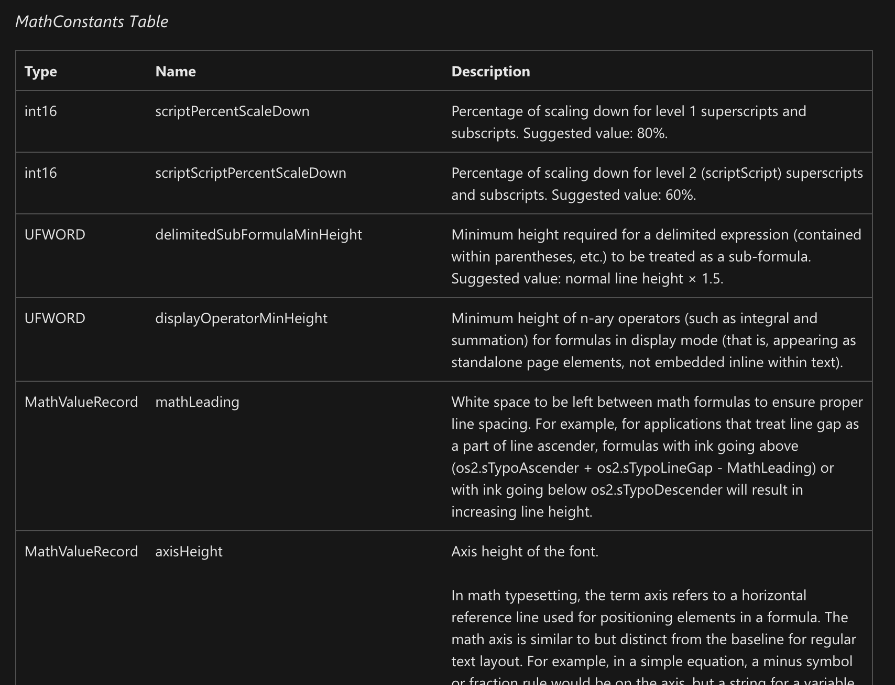

- Math Font 字体的头文件里有个专门的 math table，用于存放绘制数学字符相关的信息
- 比如要绘制指数，需要知道这么多信息
- 
- 其中 MathConstants Table 保存的是一些常量信息：
- 
- 如图，scriptPercentScaleDown：上下标缩放比例，axisHeight 轴高
- italicsCorrectionInfo 表示倾斜修正，因为数学字体很多时候用到斜体，斜体会导致字符占用空间变宽，所以要适当的向右移动后面的字体，移动幅度就保存在这个信息里
- vertGlyphConstruction 和 horizGlyphConstruction 保存的是一些需要多个字符组合的那些字符 index 信息
- 比如打括号，根号，等复杂的数学符号都是有多个字形构成的，这些表里就保存这些字形的关联符号
- 还有一些信息是约定俗成的没有放在 table 里，如果拉丁字母，斜体，等的起始位置