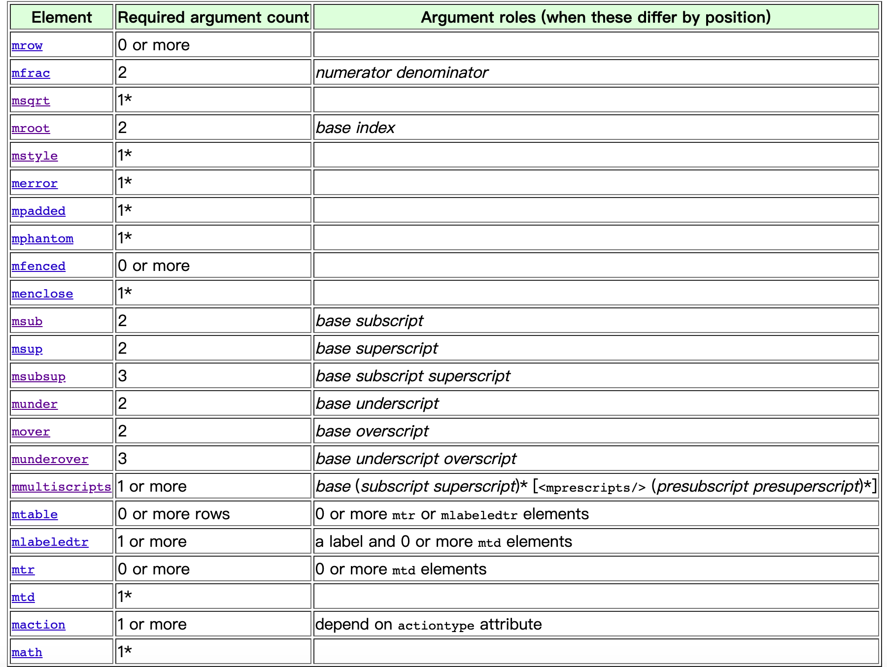

- 下面是 MathML 规定的用于表示结构的 tag，大部分情况下都可以在 Latex 中找到对应的，它设计的时候 Tex 已经出来了，所以或多或少都参考了一些
- 
- 比如
```
  <mfrac>
  <mi>1</mi>
  <mi>2</mi>
  </frac>
 ```
- 可以转成 \frac{1}{2} 
- 但是有些比较麻烦，Latex 里没有直接对应的实现，比如 <msubsup> 表示上中下结构
- 
- 用 Latex 需要组合一下 \overset{up}{\underset{down}{base}}
- 括号 <mfenced> 类型是通过参数设置的：<mfenced open="|" close=">"></mfenced> 还可以加分隔符，处理起来比较麻烦
- 比如求和也是组合的
```
  <munderover>
  <mo>&sum;</mo>
  <mrow>
  <mi>i</mi>
  <mo>=</mo>
  <mn>1</mn>
  </mrow>
  <mi>n</mi>
  </munderover>
```
- 还有比如 matrix,array 的实现它都是用的 表格