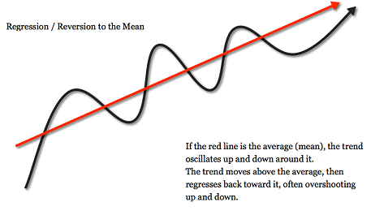

- 均值回归，最早由 弗朗西斯·高尔顿爵士 提出
- > 他发现高个子父亲的儿子身高会矮一些，而矮个子父亲的儿子身高会高一些（否则高个子家族会越来越高，而矮个子家族会越来越矮），也就是说人类的身高都会回到平均值附近，他将这种现象称为 均值回归（注：这方面欧洲比较乱，也不能排除隔壁老王的因素）。

- 这个能不能回答方豪那天的问题
- 均值回归现在主要用在经济领域，通俗的说就是跌下去的迟早会涨回来，涨上去的也迟早会跌下来，总体上趋于平均值
- 盗图
- 
- 从这可以得出：股票跌了别着急卖，它迟早会涨上来的，涨了的（超过平均线）要赶紧卖掉，因为它迟早会跌的😄（中国的股市除外）