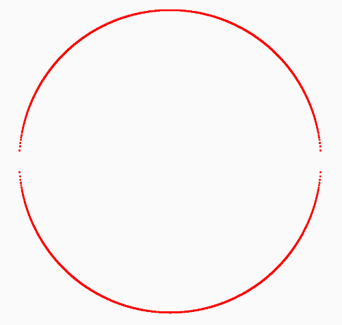
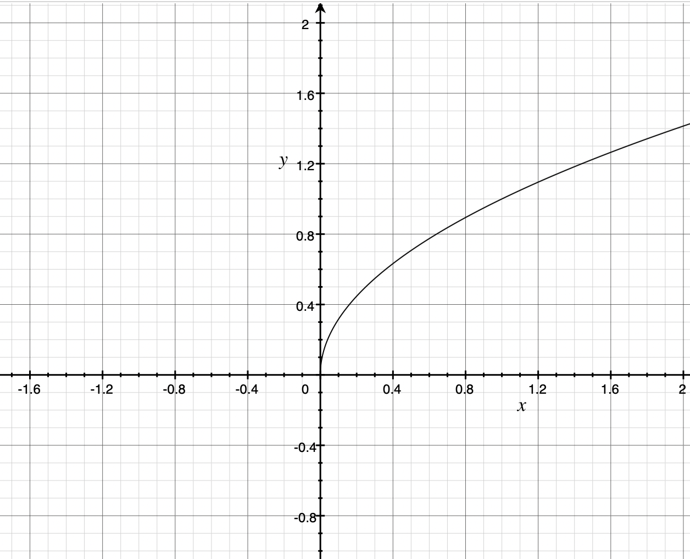
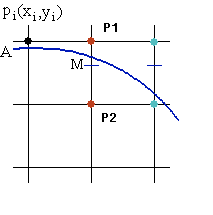
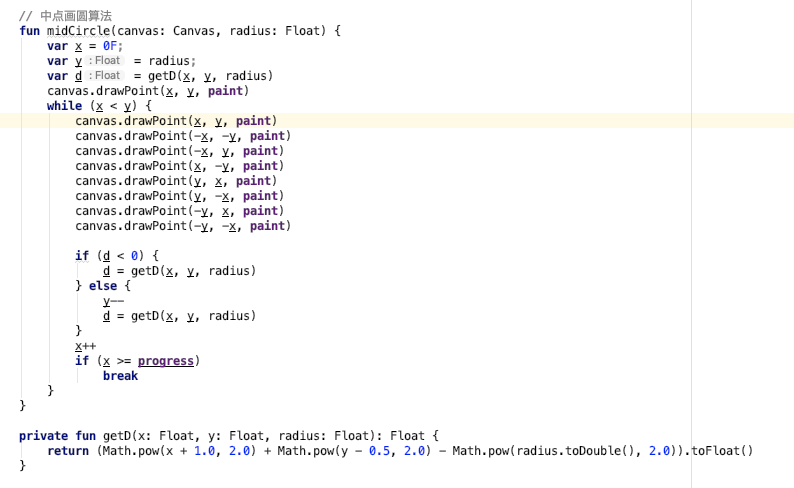

- 今天看到一个画圆的算法叫中点画圆算法，比较有意思，记录一下：
- 假设圆心在原点，那么圆的边上的点满足：x^2 + y^2 = r^2，既圆边上的点和直径的连线总是一个直角三角形
- 稍微转换下公式就能得到：y = √(r^2 - x^2)，根据这个直接就能画出一个圆来，这个算法叫直角坐标法，效果如下：
- 
- 整体看起来还行，但是为什么在 y 接近 0 的部分感觉很不连续呢？
- 这得看看 y = √x 这个公式，它的曲线是这样的：
- 
- 上面这个图可以看到 x 越靠近0 斜率越大，y 的跨度越大，而上面那个公式 √(r^2 - x^2) 在 x 接近 r 的时候，整体趋近于0，所以 y 的跨度越来越大，图形中表现出来的就是不够连续，所以这种算法不够完美，而且由于需要开根号，所以这个算法效率很低
- 第二个算法是中点画圆算法，也是利用了这个公式，稍微把上面的公式转换一下：f(x,y) = x^2 + y^2 – r^2，如果 f(x,y) = 0，这个点就在圆边上，如果 f(x,y) < 0 就在园内，如果 f(x,y) > 0，就在圆外，如下图：
- 
- 假设 M 点是 P1 和 P2 的中点，那么 M 点就是 f(x + 1,y - 0.5)，如果 < 0，证明在圆边离 P1 更近，否则离 P2 更近，根据这个规则就可以让 x 的逐渐变大一步步算出 y 的位置，代码如下：
- 
- 这个算法只能画圆的 1/8，也就是到 x = y 的时候就停止了，但是由于圆是对称的，所以就可以直接画出其他部分。