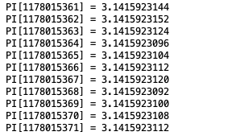

- 圆周率（Pi）是圆的周长与直径的比值，一般用希腊字母π表
- 计算Pi的方法有很多种，但是我要说的这种绝对是最笨的一种
- 算法原理很简单，假设有一个标准圆（r = 1），那么它的面积就是 S = π * r^2 = π
- 那么，把这个圆刚好圈起来的正方形的面积是 S = 2 * 2 = 4
- 

- 随机拿一个飞镖往这个地方扔（假设仍在正方形内的概率是1），那么落在圆内的概率就是 P = π/4
- 于是，我就一直那飞镖往这个地方扔，最后统计扔进圆内的和总共扔的次数，计算出概率 P
- 最后在通过公式 π = P/4 计算出 π 的值
- 这个过程可以用计算机模拟，随机取一个 x [0,1)，y[0,1) 的数字，只要他们的 x^2 + y^2 < 1，证明这个点就在圆内
- ````
    Random random = new Random();
    BigDecimal totalTimes = BigDecimal.ZERO;
    BigDecimal innerTimes = BigDecimal.ZERO;
    BigDecimal num4 = new BigDecimal("4");
    while (true) {
        double ranX = random.nextDouble() * 2 - 1;
        double ranY = random.nextDouble() * 2 - 1;
        double result = ranX * ranX + ranY * ranY;
        if (result < 1) {
            innerTimes = innerTimes.add(BigDecimal.ONE);
        }
        totalTimes = totalTimes.add(BigDecimal.ONE);
        BigDecimal PI = innerTimes.divide(totalTimes, 10, BigDecimal.ROUND_CEILING).multiply(num4);
        System.out.println("PI[" + totalTimes.toString() + "] = " + PI.toString());
    }
- 
- 扔了11.7 亿次以后，算出👆的结果
- 这种方法叫蒙特卡罗（Monte Carlo）法，是冯·诺伊曼命名的