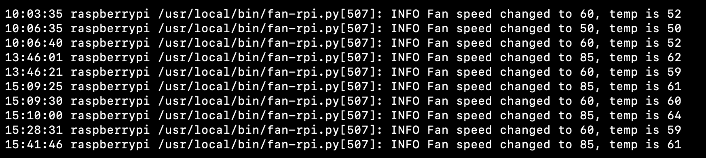

- 文件归档/备份最终方案：
- 硬件：树莓派 + 2块硬盘 + 硬盘盒
- 软件 immich + rsync
- 我组 NAS 主要是为了备份照片和一些重要的资料，远程访问+离线下载这些功能暂时还用不到
- 所以主要需求是：
  - 1.局域网同步文件
  - 2.安全可靠
  - 3.低成本
  - 4.速度说得过去就行
- 两块硬盘其中一块是作为另一块的备份，以防其中一块损坏
- 本来家里有两块移动硬盘的，想着直接连在树莓派上用就可以了，这样预算=0，但是好像带不动
- 所以不得已买了一个外接电源的硬盘盒，然后其中一块移动硬盘拆开后是 SATA 接口所以只需要再额外买一块硬盘就可以了，预算：123+275
- 备份用的这个脚本封装的 rsync：rsync-time-backup
- 这个脚本是增量备份且数据是按日期整理的

- 改进：2023-08-11
- 因为树莓派的 TF 卡非常慢，有好几次莫名其妙就卡着不动，想换成 USB 启动，接个固态硬盘
- 然后就买了个 naspi，可以把树莓派塞进去，配一个 sata 的固态硬盘当系统盘
- 就是这个：
- 
- 它内置了一个 PWM 调速的小风扇可以接到树莓派的 GPIO 口上，根据温度调速
- 
- 我装上以后，风扇一直以最大速度旋转，根据官方给的脚步设置也不起作用
- http://wiki.geekworm.com/XScript
- 想起来之前控制 LED 灯的时候就有问题，不会这么巧就是这个 GPIO 吧？
- 接个万用表接到这个针脚上，然后写个脚本循环调整针脚的输出电压：
- 发现它的电压降到 2.4 左右就下不去了
- 换个其他正常的针脚测试，是这样的，感觉像是坏了个电阻：
- 因为它连接线是这种排线，没有办法直接换针脚
- 
- 只能用杜邦线全部转接一下，接好以后好不容易才塞进去，然后再在脚本里改一下接口重新跑一下就正常了
- 