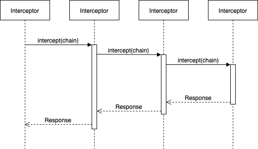

- 之前看到有个人说：牛逼的框架一般都能用一句话概括它的原理或者特点
- okhttp 采用责任链设计模式，就单凭这一个特点就能让它脱颖而出
- 我一开始以为是分开拦截请求和返回的，但是那样其实只是装饰者模式，就没有办法实现在某一个拦截器中直接中断执行并返回，事实拦截器只有一个方法：
- ````
  interface Interceptor {
      @Throws(IOException::class)
      fun intercept(chain: Chain): Response
  }
- 那是怎么实现的呢，看看这个 Chain
- ````
  interface Chain {
      fun request(): Request

      @Throws(IOException::class)
      fun proceed(request: Request): Response
      //...
  }
- 它的实现是 RealInterceptorChain，看看它的 proceed 方法，真的非常简单：
- ````
  fun proceed(request: Request, transmitter: Transmitter, exchange: Exchange?): Response {
    // ...
    // 构建下一个链，有点像递归，两个方法相互调用对方
    val next = RealInterceptorChain(interceptors, transmitter, exchange,
        index + 1, request, call, connectTimeout, readTimeout, writeTimeout)
    val interceptor = interceptors[index]
    // 执行当前的拦截器，如果拦截器不想拦截，继续执行下一个拦截器
    // 必须在 intercept 的最后调用 return chain.proceed(...)
    // 如果需要拦截则不能调用 chain.proceed(...)，需要自己构造一个
    // Response 返回
    val response = interceptor.intercept(next) ?: throw NullPointerException(
        "interceptor $interceptor returned null")
    // ...
    return response
  }
- 
