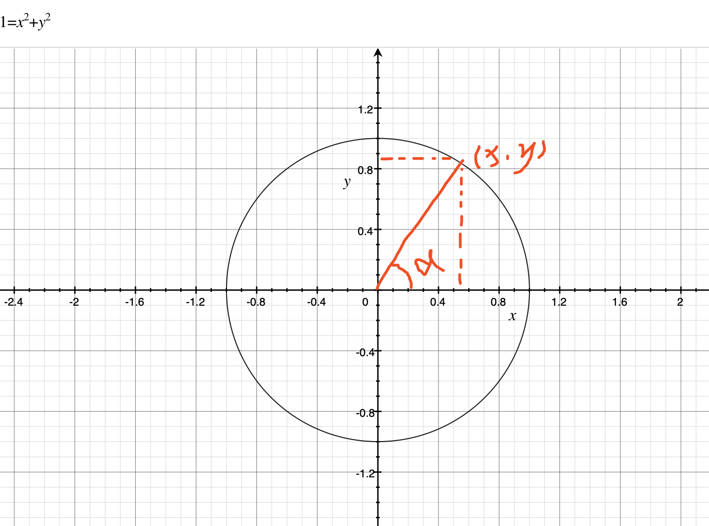
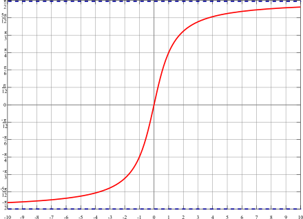
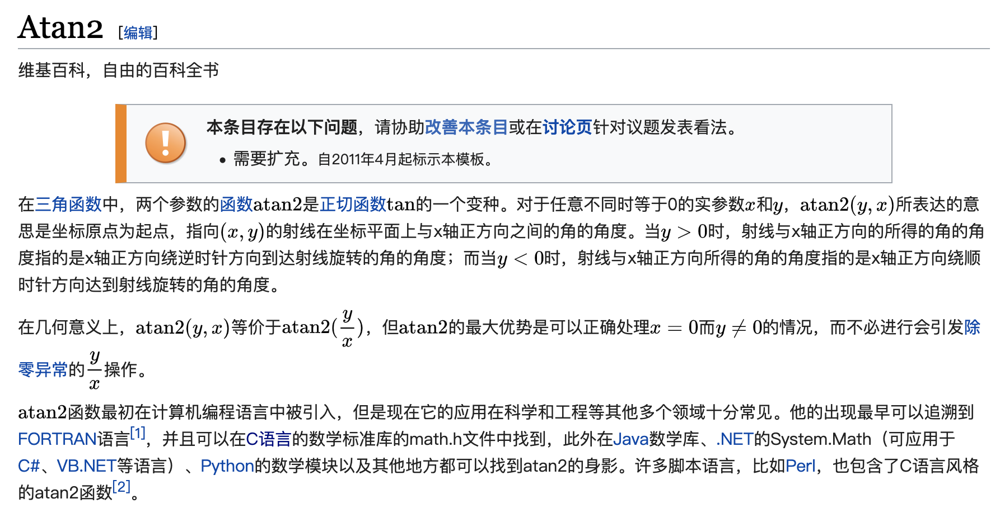

使用 OpenGL 画扇形的时候要用到反三角函数，主要是判断某个点是否落在想要的区间[fromAngle,toAngle]：
如下图：

要算出 A 的角度，可以用 atan(x/y)
然后我查了一下反正切函数定义，说它的范围说：[-PI/2,PI/2]，也就是说总共能表示的范围说 180度

但是我在使用 OpenGL 使用的时候发现它的范围居然是 [-PI,PI]，实际运行效果非常完美：

虽然很完美但是很蛋疼，突然间灵光乍现，记得还有一个 atan2 函数，搜了一下发现在 OpenGL 中，如果写成 atan(x/y) 就是普通的反正切函数，如果写成 atan(x,y)，则是 atan2 ，atan2 的范围刚好是  [-PI,PI]

