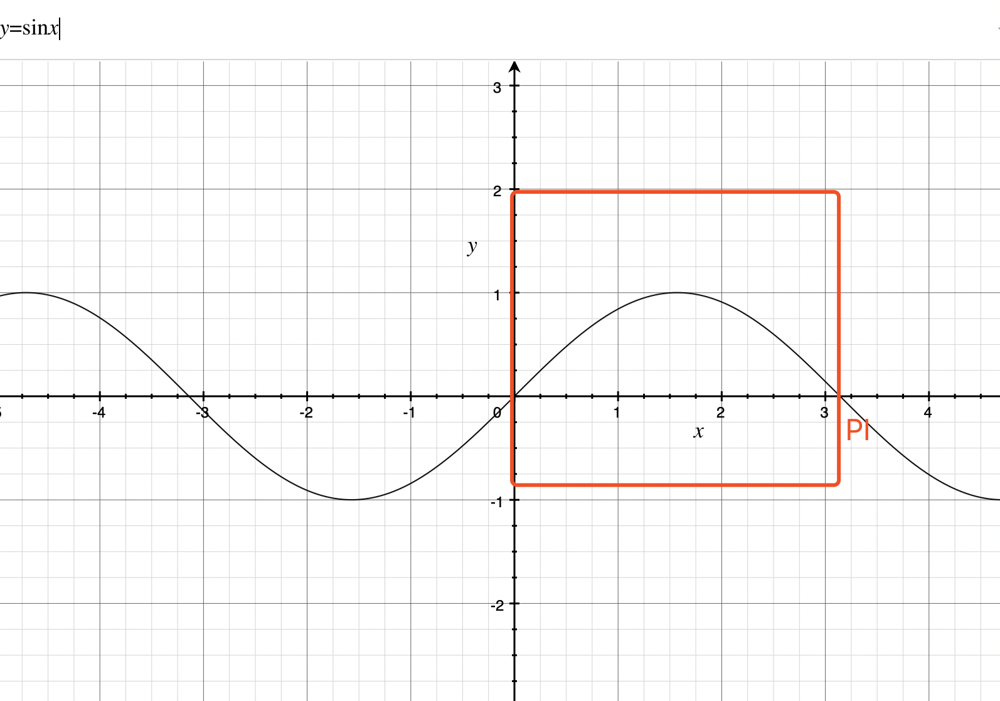
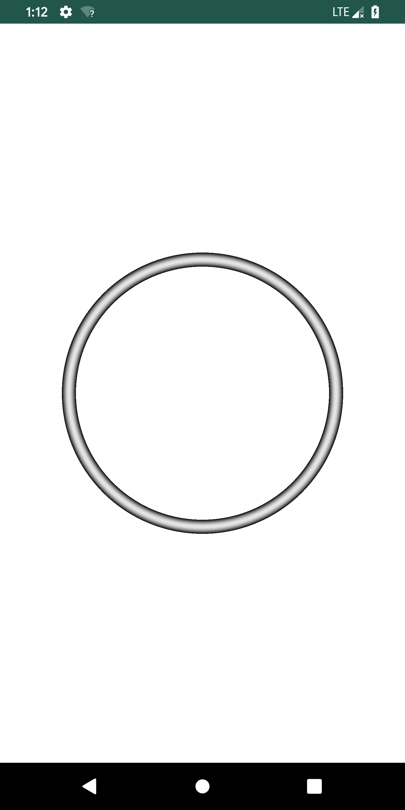
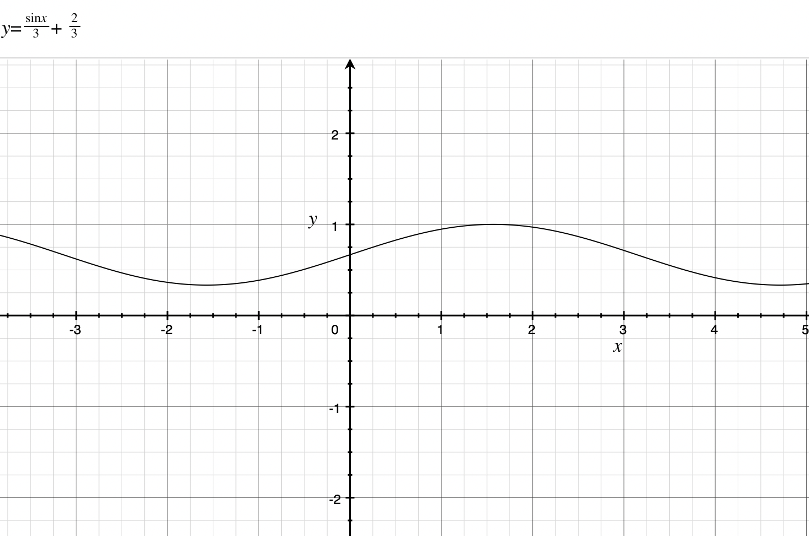

使用 OpenGL 的 Shader 画一个渐变圆环
首先指定要确定圆环的大半径和小半径：
````
// 
// 这个是当前绘制像素规范化后的位置，规范化就是把点转成 0-1 的区间
// OpenGL 默认提供的位置信息是 gl_FragCoord，这个是物理像素位置
// 你想要根据设备的宽度和高度做一下转化
// u_resolution 设备尺寸，需要用户自己传进来
vec2 st = gl_FragCoord.xy/u_resolution;
float minRadius;
float maxRadius;
vec2 center; // 圆形大位置
// 计算点与圆心大位置
float dis = distance(st,center);
// 判断距离在这个范围内的就绘制，其他的透明像素即可
if(dis > minRadius && dis < maxRadius){

}
````
单独绘制一个圆环很简单，如果想要配上渐变色稍微麻烦点
````
// 首先定义个基础颜色
vec3 color = vec3(0.9);
float ringWidth = maxRadius - minRadius;
// 根据当前绘制像素在环上的半径，计算一个影响因子
// (dis - minRadius)/ringWidth 是一个 0-1 的数字
// 0-1 在 Shader 中使用非常频繁，使用起来非常方便
// ((dis - minRadius)/ringWidth) * PI 转为一个 0 - PI 的弧度
// 然后我们使用 sin 函数对这个值计算得出我们想要的一个结果
// 为什么要用 sin？请看下图 sin 曲线
float effect = sin(((dis - minRadius)/ringWidth) * PI);
color = color * (effect);
````


sin 从 0 - PI 的值刚好是一个 从 0 - 1 - 0 的过程，非常符合我们想要的渐变效果，而且刚好又是规范化的数字。

上面逻辑的完整代码：
````
vec3 ring(vec2 st,vec2 center,float minRadius,float maxRadius){
    vec3 color = vec3(0.9);
    float dis = distance(st,center);
    if(dis > minRadius && dis < maxRadius){
        float ringWidth = maxRadius - minRadius;
        float effect = sin(((dis - minRadius)/ringWidth) * PI);
        color = color * (effect);
        return color;
    }
    return DEFAULT_COLOR;
}
````



绘制出来后看效果如上，确实是圆环，确实是渐变，但是，额，不太符合预期，我想要一个稍微浅一点的圆环，需要稍微调整一下

怎么做呢？首先，sin 的范围是 0 - 1，我们不想要从 0 - 1，想大概从 0.66 - 1 ，所以对 sin 函数下手：






嗯，比刚才好点了，但是还是比较黑，继续调整：

