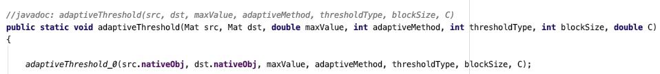
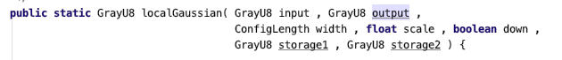
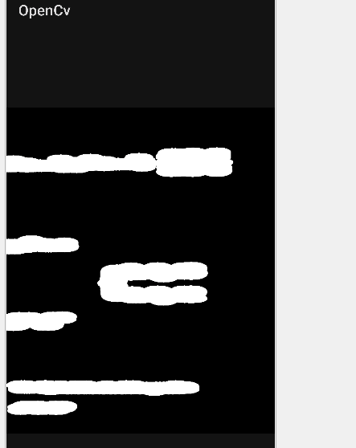
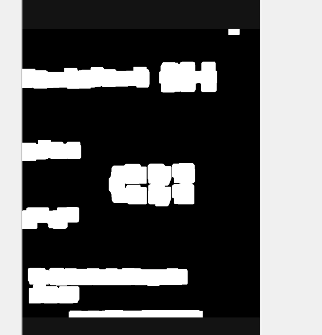
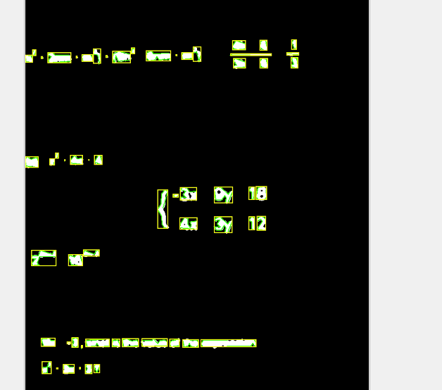

- [boofcv](https://boofcv.org/index.php?title=Main_Page) 替换 opencv
- 主要用了 opencv 的几个函数：
- threshold 二值化，就是 > 某个颜色 = 1， < 某个颜色 = 0
- findContours 查找二值化的图像的轮廓
- dilate 膨胀函数
- 这几个 opencv 函数 boofcv 都有类似的函数，但是参数和返回值完全不一样，用起来贼蛋疼
- 比如这个是 opencv 的 threshold 函数
- 
- boofcv 有好几个，这个是高斯动态二值化
- 
- 那个膨胀函数，opencv 会膨胀成一个平滑的形状，boofcv 的膨胀完还是个矩形，没法单独设置 x,y 方向
- 
- 
- 还有一点，opencv 提供了一个 boundingRect 函数永于将查找到的多边形用矩形抱起来
- 然后 boofcv 没有这个函数，只提供了 多边形/椭圆/圆形，只能自己实现
- 现在识别效果还不太满意，需要化身成为调参怪，慢慢测试各种接口，主要问题还是那个 dilate 函数
- 查找轮廓什么的没啥问题
- 