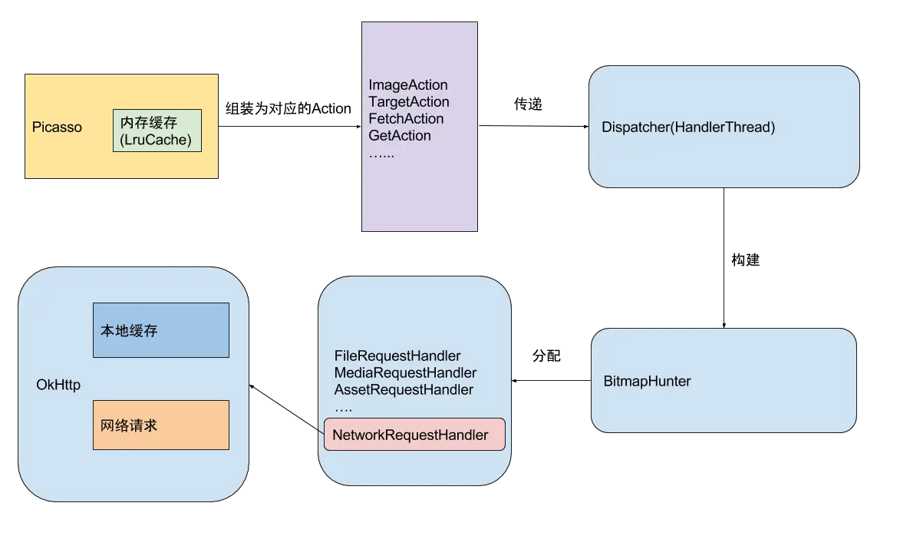

>几年前开始接触Android的时候，比较麻烦的就是图片加载和显示，虽然说本身没什么难度，但是你得关心网络，缓存，流量，内存泄漏等等，正在这个时候，Picasso出现了，名字很有艺术感有木有，它的出现，让我突然间意识到所谓的面向对象中封装的重要性和牛逼之处，简简单单的接口，不用关心内部实现，那么，用了这么久，总得了解了解它的实现吧，虽然不用重复的造轮子，但是你得知道轮子是怎么转起来呀😄😄😄

## Picasso.java

首先，我们看看Picasso的基本用法，从它的使用方法入手，一步一步的逼近真相。

````java
Picasso
	.with(context)
	.load("http://i.imgur.com/DvpvklR.png")
	.into(imageView);
````

WTF，这么简单？这尼玛离真相还有十万八千九百公里呢，请注意，是公里不是里，但是呢，Fuck归Fuck，前面的路还是要自己走啊小同志，咳咳。

### 1.Picasso.with()
这个就是传说中的单例模式，我们先看看Picasso.with(context)，这个方法干啥了：

````java
  // Picasso是一个全局静态属性，
  static volatile Picasso singleton = null;
  public static Picasso with(@NonNull Context context) {
    if (context == null) {
      throw new IllegalArgumentException("context == null");
    }
    if (singleton == null) {
      synchronized (Picasso.class) {
        if (singleton == null) {
          singleton = new Builder(context).build();
        }
      }
    }
    return singleton;
  }
````
先假装解释一波这个volatile，注意，我要开始装逼了😏，我们都知道，在多线程访问同一个变量的时候，都是将这个变量拷贝到自己的线程，在使用和修改以后，再赋值给原来的线程，这个过程由于不是一步完成的，不是原子操作，如果多个线程同时访问这个变量的时候，可能会导致最终的数值不是我们期望的，而volatile修饰的成员变量在每次被线程访问的时候，都强迫从共享内存中重读该成员变量，而在变量发生变化时，强迫线程将变化值回写到共享内存，这样就能最大程度的保证两个不同的线程看到的成员变量是同一个值，这里要注意的一点是，尽管它最大程度的保证了数据的一致性，但是由于其任然不是原子操作，也没有使用锁的机制，所以在某些情况下，还是可能会出现错误的...

“停！！！” -- 导演喊道

“导员，再让我说两句啊？” -- 我

“再不停，今晚鸡腿🍗没了” -- 导演

“/(ㄒoㄒ)/~~”

那好吧，装逼结束，如果大家想进一步了解，请移步这里，[Java并发编程：volatile关键字解析](http://www.cnblogs.com/dolphin0520/p/3920373.html)，看看这位大神给你完美的解惑。

然后我们看看为什么with方法要这么写？

首先，这是个单例，老以前，我会这么写单例（错误示范）：

````java
  static Picasso singleton = null;
  public static Picasso with(@NonNull Context context) {
    if (singleton == null) {
      	singleton = new Builder(context).build();
    }
    return singleton;
  }
````

在单线程没啥问题，但是如果在多线程，这代码就问题大大滴有，它会导致重复创建多个Picasso，额，那你会说，那改进一下吧，加一个锁：

````java
  static Picasso singleton = null;
  public static synchronized Picasso with(@NonNull Context context) {
    if (singleton == null) {
      	singleton = new Builder(context).build();
    }
    return singleton;
  }
````

>请先容老夫吐槽一哈哈，这个sync...synx...syndkfddf... f**k 这玩意怎么写啊，这么长，又没有规律，你设计java的人有没有考虑我们这种从小写象形文字人的感受，这玩意让人怎么记，你直接用sync会死啊😈

言归正传，这样不就“完美”解决了多线程访问的问题了，是吗？是解决了，但是不够完美，单例只需要被初始化一次，而因为同步锁对系统的开销是比较大的，我们获取单例的使用频率那是相当的高哇，比如我用Picasso，有一千张图片需要显示，那岂不是要锁一千次？这？...I don't like this


好吧，那我们作为有代码洁癖+强迫症的程序员，怎么能接收这样的事情呢？于是乎继续改进：

````java
  static Picasso singleton = null;
  public static Picasso with(@NonNull Context context) {
    if (singleton == null) {
    	synchronized{
    		if(singleton == null){
      			singleton = new Builder(context).build();
      		}
      	}
    }
    return singleton;
  }
````

OK，现在我们用到了帅气的DoubleCheck，总该满意了吧？这可是经典的单例实现方式啊，The answer is no. 啥？ 还 no？ O__O "…  why?

然而，国外的大神还真的说这玩意在Java中不适用，为啥呢？且听我细细道来。

首先，我们假设有两个线程同时调用了with方法

- Thread-1.with()
- Thread-2.with()

- 此时，他们都发现`singleton == null`这个惨痛的事实，于是乎，Thread-1首先获得钥匙，进入了同步锁，而且判断`if(singleton ==null)`还是个事实，所以它就执行`singleton = new Builder(context).build()`，没毛病老铁，然后它把这个值赋值给主内存，

- 接着Thread-2进入这个同步锁，也判断`if(singleton ==null)`发现这还是个惨痛的事实
- “为啥呢？”
- “谁问的？前面唾沫星子喷了这么多白说了？”
- 因为Thread-1和Thread-2中的singleton都是主内存中的拷贝，虽然Thread-1将内存赋值给了主内存，但是在Thread-2中，这个singleton还是null啊，扎心吧老铁
- 所以这个时候Thread还是会执行`singleton = new Builder(context).build()`，这个时候就会重复的创建单例，这么说来，这个做法还不如上面那个慢点的呢，虽然人家慢，但是好歹不会出问题是吧

艾亚马，太扎心了，这尼玛，放弃吗？还是用回上面那种方法吗？

No!  一定还有办法解决这个问题，正在你抓耳挠腮的时候，一道闪光从脑中闪过，上面提到的`volatile `不就刚好解决这个问题吗？这样我每次判断`if(singleton == null)`都从主内存拷贝出来，简直就是量体裁衣，啊呸，量身定做的啊，于是乎，我们继续改进为如下代码：

````java
  static volatile Picasso singleton = null;
  public static Picasso with(@NonNull Context context) {
    if (context == null) {
      throw new IllegalArgumentException("context == null");
    }
    if (singleton == null) {
      synchronized (Picasso.class) {
        if (singleton == null) {
          singleton = new Builder(context).build();
        }
      }
    }
    return singleton;
  }
````

这不就是人家Picasso源码中的写法吗...

### 2.Picasso.load()

还是老规矩，先看看这个fucking code：

````java
  public RequestCreator load(@Nullable String path) {
    if (path == null) {
      return new RequestCreator(this, null, 0);
    }
    if (path.trim().length() == 0) {
      throw new IllegalArgumentException("Path must not be empty.");
    }
    return load(Uri.parse(path));
  }
````

这里面首先做了一些判断，path是否为null，path是否为""，如果是空字符串就给我崩溃，这里要小说一下，好多人总是习惯在可能发生问题的地方用try catch的方式包裹起来，尤其是写library的时候，其实这样是很不好的写法，发现问题，我们就要把它暴露出来，让它暴露在阳光下，告诉使用我们的人，我这里崩溃了，怎么样？我骄傲了吗？如果你喜欢把它try catch起来，很容易把问题掩盖起来。

好了，继续往前走，不回头

````java
  /**
   * Start an image request using the specified URI.
   * <p>
   * Passing {@code null} as a {@code uri} will not trigger any request but will set a placeholder,
   * if one is specified.
   *
   * @see #load(File)
   * @see #load(String)
   * @see #load(int)
   */
  public RequestCreator load(@Nullable Uri uri) {
    return new RequestCreator(this, uri, 0);
  }
````

看看，它最后还是会创建一个叫RequestCreator类，程序员起名字还是比较实在，一般叫啥就是干啥的，不像人名，一点都不诚实，比如名字带 “帅”的人，不一定帅，像我名字里带 “飞” ，过山车我都不敢坐...😓

所以，我们还是去看看这个类吧：

````java
public class RequestCreator {
  private static final AtomicInteger nextId = new AtomicInteger();

  private final Picasso picasso;
  // Request.Builder里面持有一些参数的配置
  private final Request.Builder data;
  // 底下是一些配置的属性
  // 是否平缓的过度
  private boolean noFade;
  private boolean deferred;
  // 是否设置过占位图
  private boolean setPlaceholder = true;
  // 占位图ID
  private int placeholderResId;
  // 加载错误要显示的图片
  private int errorResId;
  // 内存
  private int memoryPolicy;
  // 网络
  private int networkPolicy;
  // 占位图Drawable
  private Drawable placeholderDrawable;
  // 错误图片Drawable
  private Drawable errorDrawable;
  // 用户设置的一个Tag，可以存放任何东西
  private Object tag;
  RequestCreator(Picasso picasso, Uri uri, int resourceId) {
    if (picasso.shutdown) {
      throw new IllegalStateException(
          "Picasso instance already shut down. Cannot submit new requests.");
    }
    this.picasso = picasso;
    this.data = new Request.Builder(uri, resourceId, picasso.defaultBitmapConfig);
  }
}
````

我们看它的属性，大概就能知道它能干什么，如，它可以设置占位图，加载错误的占位图，是否显示图片切换时候的过度动画等等，所以，它在Picasso从加载图片到显示的过程中发挥的作用，应该是准备阶段，同时给ImageView设置一个加载中的占位图，那，同时呢，它还持有一个叫`Request.Builder`的东西，这位兄弟看名字就知道是一个使用Builder模式的类，里面肯定也有一大堆配置的属性，看看吧：

````java
  public static final class Builder {
    private Uri uri;
    private int resourceId;
    private String stableKey;
    private int targetWidth;
    private int targetHeight;
    private boolean centerCrop;
    private int centerCropGravity;
    private boolean centerInside;
    private boolean onlyScaleDown;
    private float rotationDegrees;
    private float rotationPivotX;
    private float rotationPivotY;
    private boolean hasRotationPivot;
    private boolean purgeable;
    private List<Transformation> transformations;
    private Bitmap.Config config;
    private Priority priority;
````

果然不出老夫所料，这都是些密密麻麻的配置，老夫就不细说了，图片相关的配置，底下肯定跟一堆Setter方法，至于Builder模式的好处，看看这位童鞋说的吧，我也懒得讲：[设计模式之Builder模式](http://www.jianshu.com/p/e2a2fe3555b9)

我们继以RequestCreator里面的一个方法作为一个示例，瞅瞅它是怎么做的：

````java
  /** Resize the image to the specified size in pixels. */
  public RequestCreator resize(int targetWidth, int targetHeight) {
    data.resize(targetWidth, targetHeight);
    return this;
  }
````

假如我想将这种图片的大小限制为我指定的大小，原图是1024*1024，但是在不同的设备上，其实根本不需要这么大的图片，而且会很吃内存，所以我要根据设备实际的大小裁剪图片，于是我们用到resize()方法，那我们看，其实它是先将这个信息保存到我们前面讲到Request.Builder中。

所以讲了这么多，都还是在做准备工作，所有的信息虽然我们都给了Picasso（额，其实很多信息我们都没有给Picasso，比如图片裁剪方式），但是它就是没有发起网络请求，仍然只是将信息保存到RequestCreater或是Request.Builder中，也就是说，load()方法只是准备工作，而真正的网络请求是接下来的这个方法触发的。

### 3.Picasso.into()

Picasso.into() 有8个重载方法，但是万变不离其宗，找一个最基本的看看它嘎哈了：

````java
  public void into(ImageView target, Callback callback) {
    long started = System.nanoTime();
    // 检查一下是否在主线程
    checkMain();

	// ... 这里删掉一些检查的代码
	
	// 是否延期执行了，延期是为了保证ImageView已经布局完成，
	// 既已经有大小了，如果这个状态为true，则Picasso自动将
	// 图片裁剪为匹配目标大小
    if (deferred) {
      // 如果设置了匹配ImageView大小，则用户不能自定义大小
      if (data.hasSize()) {
        throw new IllegalStateException("Fit cannot be used with resize.");
      }
      int width = target.getWidth();
      int height = target.getHeight();
      // 如果ImageView宽高有一个为0，则延期执行这个方法
      if (width == 0 || height == 0 || target.isLayoutRequested()) {
        if (setPlaceholder) {
          setPlaceholder(target, getPlaceholderDrawable());
        }
        picasso.defer(target, new DeferredRequestCreator(this, target, callback));
        return;
      }
      data.resize(width, height);
    }
	// 这里调用createRequest()将我们上面提到的那个data
	// 转换为Request，其实就是调用了一下build()
    Request request = createRequest(started);
    String requestKey = createKey(request);
    
	// 检查一下用户配置，是否从内存中读取Bitmap
	// 既如果用户配置了Picasso支持缓存到内存，则
	// 先从内存中读取数据，如果内存中读取到数据，则
	// 直接将该Bitmap设置到ImageView并提示加载成功
	// 返回
    if (shouldReadFromMemoryCache(memoryPolicy)) {
      Bitmap bitmap = picasso.quickMemoryCacheCheck(requestKey);
      if (bitmap != null) {
      	// 取消请求
        picasso.cancelRequest(target);
        setBitmap(target, picasso.context, bitmap, MEMORY, noFade, picasso.indicatorsEnabled);
        if (picasso.loggingEnabled) {
          log(OWNER_MAIN, VERB_COMPLETED, request.plainId(), "from " + MEMORY);
        }
        if (callback != null) {
          callback.onSuccess();
        }
        return;
      }
    }
	// 如果内存中没有数据，接着往下走
	// 设置占位图
    if (setPlaceholder) {
      setPlaceholder(target, getPlaceholderDrawable());
    }

	// 构建一个ImageViewAction，这样的Action在Picasso中
	// 有多个，都是继承自Action，Action是一个抽象类，它定义
	// 了一些通用的功能，而需要差异化实现的就有继承它的类去实现
	// 差异化的操作主要在complete()和error()两个方法
	// 在此处ImageViewAction需要将做种获取到的Bitmap显示
	// 到ImageView上，而TargetAction则会将获取到的Bitmap
	// 传递出去，这就是继承的巧妙之处，所以别再傻乎乎的为了
	// 复用而继承了
    Action action =
        new ImageViewAction(picasso, target, request, memoryPolicy, networkPolicy, errorResId,
            errorDrawable, requestKey, tag, callback, noFade);
    picasso.enqueueAndSubmit(action);
  }
````

对上面的代码，我又一个小小的疑惑，照理来说，Picasso应该有三级缓存呀，既：内存，本地，网络，为啥现在只看到检查内存，然后就没有了呢？这个我们再最后会讲到，我们还是继续往下看看

`Picasso.enqueueAndSubmit()`

````java
  void enqueueAndSubmit(Action action) {
    Object target = action.getTarget();
    // 先还是检查一下这个对象当前有没有正在执行的Action
    // 如果有的话，先取消一下，然后再把即将进行的请求存起来
    if (target != null && targetToAction.get(target) != action) {
      // This will also check we are on the main thread.
      cancelExistingRequest(target);
      targetToAction.put(target, action);
    }
    submit(action);
  }
  
  // submit很简单，通过一个叫dispatcher的东西传递出去
  // dispatch这个单词在触摸时间那块有见到过，分发事件的意思
  // 难道这里也是分发吗？
  void submit(Action action) {
    dispatcher.dispatchSubmit(action);
  }
````

### 4.Dispatcher
上面的代码很简单，唯一比较有意思的应该就是这个dispatcher的东西，看起来，是由它来处理我们的Action，那我们还是看看这个Dispatcher吧

````java
class Dispatcher {
  final DispatcherThread dispatcherThread;
  final Handler handler;
  Dispatcher(...) {
    ...
    // 这是个HandlerThread
    this.dispatcherThread = new DispatcherThread();
    // 这个Handler是一个自定义的Handler
    this.handler = new DispatcherHandler(dispatcherThread.getLooper(), this);
    // 这个Handler是由Picasso传递进来的Handler
    this.mainThreadHandler = mainThreadHandler;
    ...
  }
  
  void dispatchSubmit(Action action) {
    handler.sendMessage(handler.obtainMessage(REQUEST_SUBMIT, action));
  }
}
````

我在上面省去很多代码，我们只看关键部分，

* 首先，为啥被修饰为final的属性可以被重新赋值？额，查了查资料，原来是我读书少，final的属性如果没有被初始化过，可以在构造方法或者代码块中初始化一次。

* 其次，这块代码用到了HandlerThread和Handler配合使用。我们都知道Handler被用于线程间通信，而HandlerThread很显然是一个异步的线程，那么就是说，HandlerThread这个线程通过Handler来接收我们的消息，然后在它的线程处理，具体HandlerThread的好处是它可以一直在异步线程接收Handler发送的消息，而它的用法，可以看看别人写好的分析，我在网上随便找了一篇，[详解 Android 中的 HandlerThread - 技术小黑屋](http://www.tuicool.com/articles/n2Y3M3R)，这种东西一搜一大堆，当然，如果你能读懂英文的话，建议读官方的介绍文档是极好的。

* 那我们看看dispatchSubmit()方法正是发送一个`REQUEST_SUBMIT`消息到DispatcherHandler的handleMessage()方法中，注意，这个handleMessage()所在的线程就是DispatcherThread的线程

````java
  private static class DispatcherHandler extends Handler {
    private final Dispatcher dispatcher;
    @Override public void handleMessage(final Message msg) {
      switch (msg.what) {
      	...
        case REQUEST_SUBMIT: {
          Action action = (Action) msg.obj;
          dispatcher.performSubmit(action);
          break;
        }
        ...
    }
  }
````
从上面可以看出，Handler在接收到`REQUEST_SUBMIT`消息后，执行了performSubmit()

````java
  void performSubmit(Action action, boolean dismissFailed) {
    ...
    // BitmapHunter继承自Runnable
    // 先在hunterMap中检查是否存在这个BitmapHunter
    BitmapHunter hunter = hunterMap.get(action.getKey());
    if (hunter != null) {
    	// 如果存在，只需将传入的action替换掉即可
      hunter.attach(action);
      return;
    }
    ...
    // 创建一个BitmapHunter
    hunter = forRequest(action.getPicasso(), this, cache, stats, action);
    // 通过ExecutorService线程池执行BitmapHunter
    // 注意，这里没有调用future.get()，所以它还是异步的
    hunter.future = service.submit(hunter);
    // 缓存hunter
    hunterMap.put(action.getKey(), hunter);
    ...
  }
````

### 5.BitmapHunter

一步步走带这里真不容易，上面一串代码用到了一个很关键的类，那就是BitmapHunter，去看看吧

````java
  // 首先，forRequest是一个静态方法，它返回一个BitmapHunter
  static BitmapHunter forRequest(Picasso picasso, Dispatcher dispatcher, Cache cache, Stats stats,
      Action action) {
    Request request = action.getRequest();
    // 这个RequestHandler也是一个基类，实现它的类有：
    // AssetRequestHandler,FileRequestHandler,
    // MediaStoreRequestHandler,NetworkRequestHandler
    // 等等，有很多，单从名字我们猜测可能是具体的获取数据的类
    // FileRequestHandler是从文件系统获取，
    // NetworkRequestHandler是从网络获取
    List<RequestHandler> requestHandlers = picasso.getRequestHandlers();

    // for循环检查所有的RequestHandler，直到找到
    // 支持解析(canHandleRequest()) request 的RequestHandler
    for (int i = 0, count = requestHandlers.size(); i < count; i++) {
      RequestHandler requestHandler = requestHandlers.get(i);
      if (requestHandler.canHandleRequest(request)) {
        return new BitmapHunter(picasso, dispatcher, cache, stats, action, requestHandler);
      }
    }
	// 如果没有找到，构造一个默认的BitmapHunter
    return new BitmapHunter(picasso, dispatcher, cache, stats, action, ERRORING_HANDLER);
  }
````

其中我们找到初始化所有RequestHandler的地方，在Picasso的构造方法里，如下，自己体会

````java
    allRequestHandlers.add(new ContactsPhotoRequestHandler(context));
    allRequestHandlers.add(new MediaStoreRequestHandler(context));
    allRequestHandlers.add(new ContentStreamRequestHandler(context));
    allRequestHandlers.add(new AssetRequestHandler(context));
    allRequestHandlers.add(new FileRequestHandler(context));
    allRequestHandlers.add(new NetworkRequestHandler(dispatcher.downloader, stats));
    requestHandlers = Collections.unmodifiableList(allRequestHandlers);
````

RequestHandler的具体实现我们后面再讲，继续看BitmapHunter，由于它是继承自Runnable，所有肯定有一个run()方法，我们看看它在新的线程中都干了些啥：

````java
  @Override public void run() {
    try {
      ...
      // 调用hunt()方法，并判断返回值
      result = hunt();
	  // 根据返回值处理回调
      if (result == null) {
        dispatcher.dispatchFailed(this);
      } else {
        dispatcher.dispatchComplete(this);
      }
    }  catch (Exception e) {
      exception = e;
      dispatcher.dispatchFailed(this);
    }
    ...
  }
````

OK，那看来一切的处理都被放在hunt()里面了，这里为什么要这么写呢？完全可以把hunt()中的方法放在run()里面写呀？我认为有两点原因：

1. 首先，如果把hunt()中的实现都放在这里会导致这个方法非常的大，而且又加了try catch，会导致代码读起来很费劲
2. 其次，也是最主要的，我觉得是为了让一个方法尽可能的只干一件事件，方便单元测试

````java
  Bitmap hunt() throws IOException {
    Bitmap bitmap = null;
	// 首先检查了一下内存中有没有存在这个图片
    if (shouldReadFromMemoryCache(memoryPolicy)) {
      bitmap = cache.get(key);
      if (bitmap != null) {
        stats.dispatchCacheHit();
        loadedFrom = MEMORY;
        if (picasso.loggingEnabled) {
          log(OWNER_HUNTER, VERB_DECODED, data.logId(), "from cache");
        }
        return bitmap;
      }
    }
	
    networkPolicy = retryCount == 0 ? NetworkPolicy.OFFLINE.index : networkPolicy;
    // 开始调用对应的RequestHandler加载图片
    RequestHandler.Result result = requestHandler.load(data, networkPolicy);
    if (result != null) {
      loadedFrom = result.getLoadedFrom();
      // 获取图片的扩展信息
      exifOrientation = result.getExifOrientation();
      bitmap = result.getBitmap();

      // If there was no Bitmap then we need to decode it from the stream.
      if (bitmap == null) {
        Source source = result.getSource();
        try {
          bitmap = decodeStream(source, data);
        } finally {
          try {
            //noinspection ConstantConditions If bitmap is null then source is guranteed non-null.
            source.close();
          } catch (IOException ignored) {
          }
        }
      }
    }

	// stats是一个用来统计的类，我们先不管它
    if (bitmap != null) {
      if (picasso.loggingEnabled) {
        log(OWNER_HUNTER, VERB_DECODED, data.logId());
      }
      stats.dispatchBitmapDecoded(bitmap);
      if (data.needsTransformation() || exifOrientation != 0) {
      	// 这里加了一个同步锁，保证同时只能有一个线程处理Bitmap
      	// 最大限度避免了OOM，同时也降低了对手机性能的影响
        synchronized (DECODE_LOCK) {
          if (data.needsMatrixTransform() || exifOrientation != 0) {
          // 有时候可能需要旋转或者位移一下图片
            bitmap = transformResult(data, bitmap, exifOrientation);
            if (picasso.loggingEnabled) {
              log(OWNER_HUNTER, VERB_TRANSFORMED, data.logId());
            }
          }
          // 是否有自定义的图片转换，比如裁成圆角矩形呀，
          // 这个需要用户自定义的，使用起来也很简单
          // 传入一个原始的Bitmap，返回一个新的Bitmap
          if (data.hasCustomTransformations()) {
            bitmap = applyCustomTransformations(data.transformations, bitmap);
            if (picasso.loggingEnabled) {
              log(OWNER_HUNTER, VERB_TRANSFORMED, data.logId(), "from custom transformations");
            }
          }
        }
        if (bitmap != null) {
          stats.dispatchBitmapTransformed(bitmap);
        }
      }
    }

    return bitmap;
  }
````

### 6.RequestHandler
现在，我们在回过头来看看RequestHandler，我们以NetworkRequestHandler为例：

````java
class NetworkRequestHandler extends RequestHandler {
  private static final String SCHEME_HTTP = "http";
  private static final String SCHEME_HTTPS = "https";
  
  @Override public boolean canHandleRequest(Request data) {
    String scheme = data.uri.getScheme();
    return (SCHEME_HTTP.equals(scheme) || SCHEME_HTTPS.equals(scheme));
  }

  @Override public Result load(Request request, int networkPolicy) throws IOException {
  	// 使用OKHttp加载数据
    okhttp3.Request downloaderRequest = createRequest(request, networkPolicy);
    Response response = downloader.load(downloaderRequest);
    ResponseBody body = response.body();

    if (!response.isSuccessful()) {
      body.close();
      throw new ResponseException(response.code(), request.networkPolicy);
    }

    // 检查数据来源为网络还是本地存储
    Picasso.LoadedFrom loadedFrom = response.cacheResponse() == null ? NETWORK : DISK;
    return new Result(body.source(), loadedFrom);
  }
}
````

前面我们提到为什么Picasso只有内存和网络两种缓存，从这里，我们可以看出，其实它也是有本地缓存的，只不过它使用了OkHttp进行本地缓存，所有不需要自己再写一次了，这样做虽然方便，但是如果需要更换一个网络加载库的时候，如果网络库不支持缓存，则需要自己手动写一个了。

### 总结
通过分析Picasso的源码呢，我们能深入的了解Picasso的工作原理以及它的一些代码技巧：
- 单例的正确姿势
- `volatile` 关键字的原理和使用场景
- HandlerThread的使用
- 线程池ExecutorService的使用以及搭配synchronized关键字限制线程消耗
- 合理的封装方式
- 弱引用和缓存的使用