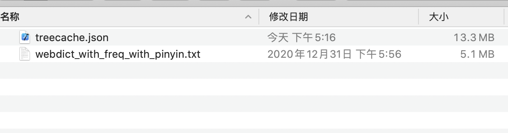
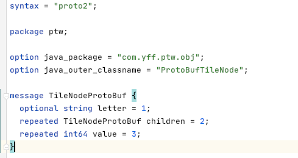

- 想找个拼音转汉字的库（类似于词典），找了好几年一直没有找到，只有中文转拼音的或者是只有词库+词频这种东西
- 大学的时候做个类似的东西奈何那会没有 git 代码丢了
- 今天抽时间简单的弄了一个
- 这个东西要分两部分，第一部分是拼音，用 Trie Tree 的数据结构，一般词典都用这个
- 
- 这样的话，根据输入一个节点一个节点的去找，每个节点还要存对应的词条位置信息
- 第二部分是词库部分，网上找了一个还算丰富的词库，22W 条数据
- 
- 由于这个没有拼音，所以找了一个 TinyPinyin 先生成拼音
- 然后遍历一下，根据拼音将词条的位置信息存到 Trie 树中去，可能有多条信息所以要用数组存
- 词库就还是一个文本文件
- 这样查找的时候，先从 Trie 树找到词条的位置，再用 RandomAccessFile seek 到词条的位置读取
- 测试了一下速度还可以，基本都在 0.2 ms 以内
- 
- 可以优化的点：
- 词库用二进制的方式存储，缩小体积，读取速度更快
- Trie 树序列化，没必要每次启动都初始化一遍

- 字典树的缓存，为了简单我直接用 Json 缓存了，查了一下竟然有 21.3MB
- 
- 它一共有3个字段，然后我用 SerializedName 注解把名字替换成 a,b,c
- 
- 缓存减少了差不多一半，效果还不错
- 
- 用 ProtoBuf 可能更小，和 Json 方式做个对比
- 写文件耗时：
- 
- 解析文件耗时
- 
- 写入文件大小
- 
- 这个差距还是蛮大的
- Protocol Buffer 使用稍微复杂点，要先声明一个 .proto 的描述性文件
- 
- 然后再用 protocol buffer compiler 的工具将描述文件转成一个 Java 类
- 这里有个比较坑的地方是，我是用 Java 的 Gradle 项目测试的，它生成的是 Java 代码，然后我把它放在 kotlin 文件夹下一直报错 NoClassFound，挪到 java 文件夹下就正常了
- 然后再需要的地方把你的数据转换为生成的数据对象，它提供一个 writeTo 方法，传入一个 OutputStream 就可以了
- 
- 还有一个优化的点是合并空节点，有些节点很长，但可能只有最后一个有数据，其他的接口都只是路过
- 比如下面这种情况, nia 并不是一个拼音，没有对应的字，这样就可以和后面的 n 合并为一个
- 
- 合并的原则是，如果当前节点没有数据且只有一个子节点就可以合并，这样可以有效的缩短树的深度
- 下面是优化的代码
- 

::github{repo="goyourfly/PinyinToWords"}