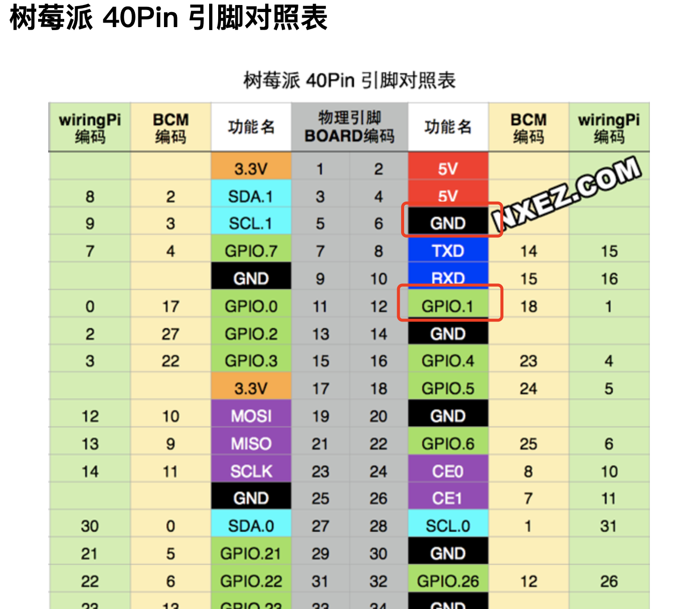
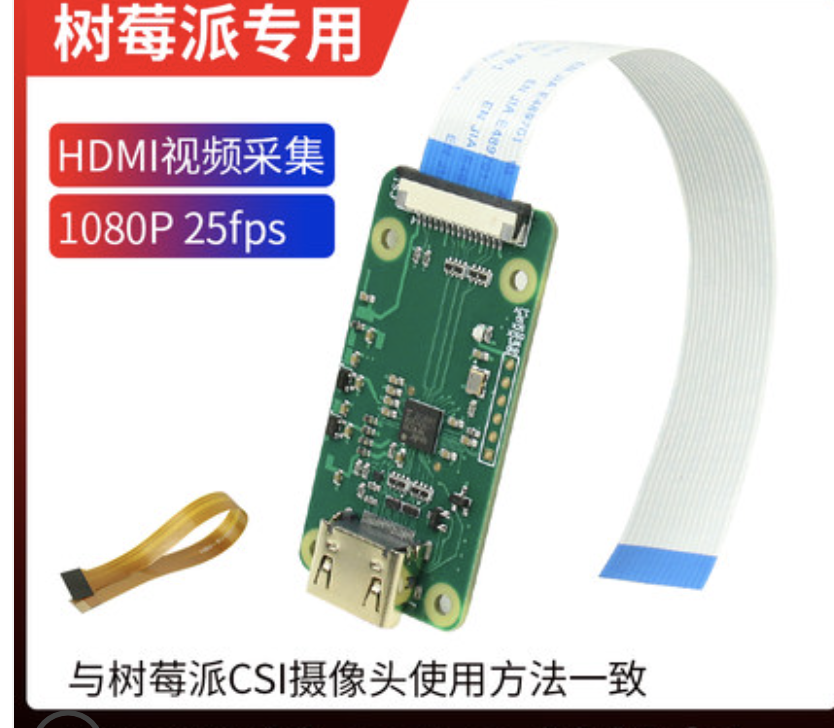

- 电视背光灯同步电视画面
- 硬件准备：
- 一条 WS2812B 灯带，根据电视大小购买即可，买那种带双面胶的，我买了5米的，实际用不了那么多
- 5V10A 的电源，电流最好大一点，要不然灯带的亮度可能不够
- DC 接头，主要是方便接电源
- 杜邦线若干，主要是用来接树莓派的引脚，买那种公母头的方便延长
- 树莓派
- 一台 Android 手机
- 先用 DC 接头把电源和 WS2812B 的供电接好，就像下面这样红线接正极，GND 接地
- 
- 接上后你会发现 LED 并没有亮，我还以为坏的，后来发现还需要给灯带发指令才会亮
- 然后再接把灯带的 GND 接到树莓派引脚的 GND，Din 接 GPIO.1
- 
- 在树莓派上装好 WS2812B 的 python 库，
- sudo pip3 install rpi_ws281x adafruit-circuitpython-neopixel
- 写个简单的 python 脚本测一下是否正常工作
```
import board
import neopixel
pixels = neopixel.NeoPixel(board.D18, 30)
pixels[0] = (255, 0, 0)
```
- 跑一下这个脚本，第一个 LED 灯应该显示红色
- 然后把灯带粘到电视背面，数一下每一边 LED 的数量，脚本里面要根据位置去设置颜色
- 写个 Android 的 App，从摄像头采集画面，计算出电视画面边缘的颜色并发送给树莓派
- 树莓派启动个服务，接收 Android 这边发的信息，然后设置对应的颜色就 ok 了
- 我一开始开的 http 服务，结果发现延迟特别高，可能是请求发的太快了，后来改成 socket 就好多了，但是 socket 的分包比较麻烦
- 整体实现方案：摄像头采集画面计算颜色，传输给树莓派，然后再由树莓派控制每颗LED灯的颜色
- 本来想用录屏的方式采集颜色，结果发现电视播放视频的时候录不到画面😅
- 改进：
- 准备单独弄个摄像头从电视获取颜色信息再反馈到 LED 上，这样就可以脱离手机使用了，有个问题，比如摄像头拍了一张照片，怎么在照片中找出电视到位置裁出来
- 方案1.最先想到到方案是用 OpenCV 的 Canny 算法或者现在有个新的 HED 获取轮廓，再用 HoughLinesP 查找轮廓中到直线，最后根据交点信息计算出电视机到位置，实测这个方案很垃圾，很容易被干扰，而且同一个轮廓会出现找出很多直线，所以要根据线条的角度和距离去重，然后换个角度算出来就不对了，这种方案适合纯色背景下找一些东西的位置
- 方案2.用神经网络的东西去识别，虽然能识别出来，但是一般只提供一个矩形框框，没找到一个合适的库，可以先用方案2获取大概位置，然后再用方案1
- 方案3.拍几张照片，比对他们之间的差异，一般只有电视画面变化，其他部分相对静止，这样就可以通过一组照片找出差异部分，找到最佳位置
- 感觉方案3比较靠谱，不过还是应该提供一个 App 去手动矫正，就像大部分文档扫描工具那样😅
- 改进：
- 昨天树莓派的摄像头到货了，一个160度的广角摄像头，因为想放在电视柜上拍，所以需要用广角的，但是形变比较严重，而且还有一个没想到的问题是电视屏幕太垃圾，从下往上拍的时候显示效果很差
- 试了一下方案3：通过比对两张照片的差异定位电视在图片中的位置
- 这是两张照片，
- 
- 
- 先通过 skimage.ssim 算法算出差异的部分，它算出来的是每个像素点的差异，每个像素点 [0,1] 的一个矩阵
- 四舍五入 * 255 就转化成一张黑白图，白色部分是差异明显的，黑色部分是差异不明显的
- 那几个白色的方块是我故意放上去干扰的
- 这个时候其实已经可以通过凸多边形描边，找出其中面积最大的多边形，就像下面这个框起来的
- 但是为了安全起见，尝试去掉其中无关的部分，比如上面图中我加的几个形状
- 所以用 DBSCAN 聚类算法，将图片中的白色像素分成不同的堆，它是根据密度分类的
- 这个网站通过动画的方式演示了 DBSCAN 分类的原理
- 这样就可以找到画面中的主体部分
- 
- 改进：2021-12-24
- 分享一个控制 LED 灯光，实现电视流光溢彩效果的项目 https://github.com/hyperion-project/hyperion.ng，它的作用是把电视画面的颜色颜色反映到 LED 上
- 需要材料：树莓派，树莓派 HDMI IN 配件，HDMI 分配器（注意不是分线器），HDMI 线3根，电视盒子或其他的 HDMI 输出设备，电视，LED 灯带+电源（我之前买的是 WS2812），杜邦线
- 
- 
- 
- 安装：用 HDMI 分配器将盒子的视频信号一分为二，一份输入到显示器作为正常画面显示，一份输入到树莓派，因为树莓派不支持直接输入 HDMI，所以要用一个 HDMI IN 配件将 HDMI 信号转化成 CSI 信号通过树莓派的摄像头接口输入树莓派终
- 然后在树莓派上安装上面的那个项目，安装的时候一直提示找不到一个 lib，单独装一下就好了
- 软件跑起来以后就可以远程访问这个服务进行配置了，配置界面如下，现在那些配件还在路上所以就先用一个树莓派摄像头当作信号源先试试效果，
- 之前弄过一次是通过摄像头从电视画面中取颜色，这样干扰太大，而且每次都得调整位置很麻烦，现在再折腾折腾试试这种方案
- 
- 改进：2022-01-07
- 之前分享的树莓派控制灯带的方法不行🙅，通过相机接口输入的 HDMI 信号不知道为啥是黑白的，而且很模糊，有时候又不显示，很不稳定
- 然后尝试通过传统方案实现 HDMI 转模拟信号的方式，于是流程就变成这样
- 
- 这种方案比较成熟，网上的教程很多，好在这些配件都不贵
- 但是买回来以后鼓捣了好久弄好发现树莓派确实是能接收到信号，但是树莓派控制不了灯带了，直接写代码控制灯珠都没有反应，初步怀疑是买了劣质灯带，然后就就买了一盘顺便买了一个控制器
- 收到货后又试了一下控制器可以控制灯带，但树莓派还是不行，但是如果直接接个 LED 灯泡测试那个针脚是有电的，裂开了
- 打开淘宝看了一下树莓派的价格比之前我买的时候几乎贵了一倍，放弃了
- 然后又查查查资料找到另外一种方案，不用树莓派的针脚了，用一个 Wifi 芯片来控制灯带，然后树莓派发送命令给这个 Wi-Fi 芯片间接控制，而且这个芯片价格很便宜，很多通过 Wi-Fi 物联网的设备都用这个
- 
- 买到以后要烧固件，默认的固件不是处理灯带的，刷一个控制灯带的固件进去就可以通过手机 App 或者网页控制灯带，然后再树莓派上配置一下就可以了