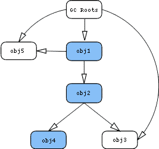
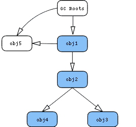

- 查看 Java heap 时常能看到一个对象 Shallow size 和 Retained size
- 大概知道是，Shallow size 指对象自己的大小（属性的大小和数量决定），比如一个数组的 Shallow size 大小是由它的 length 和它存储的对象类型决定
- Retained size 指对象和与他关联的所有对象的大小，就是很多个 Shallow size 相加
- 但是其实 Retained size 要除去由 GCRoot 引用的对象
- 
- 
- 图 1 中，obj1 的 Retained size = obj1 + obj2 + obj4
- 图 2 中，obj1 的 Retained size = obj1 + obj2 + obj3 + obj4
- 之所以图 1 中没有计算 obj 3 是因为它被 GCRoot 引用