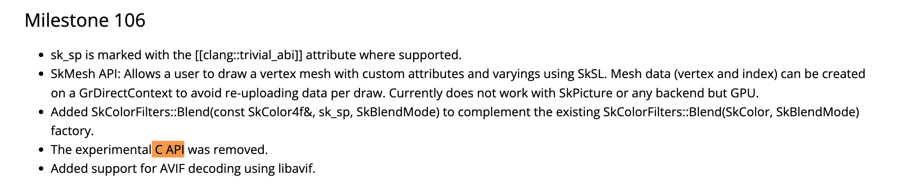
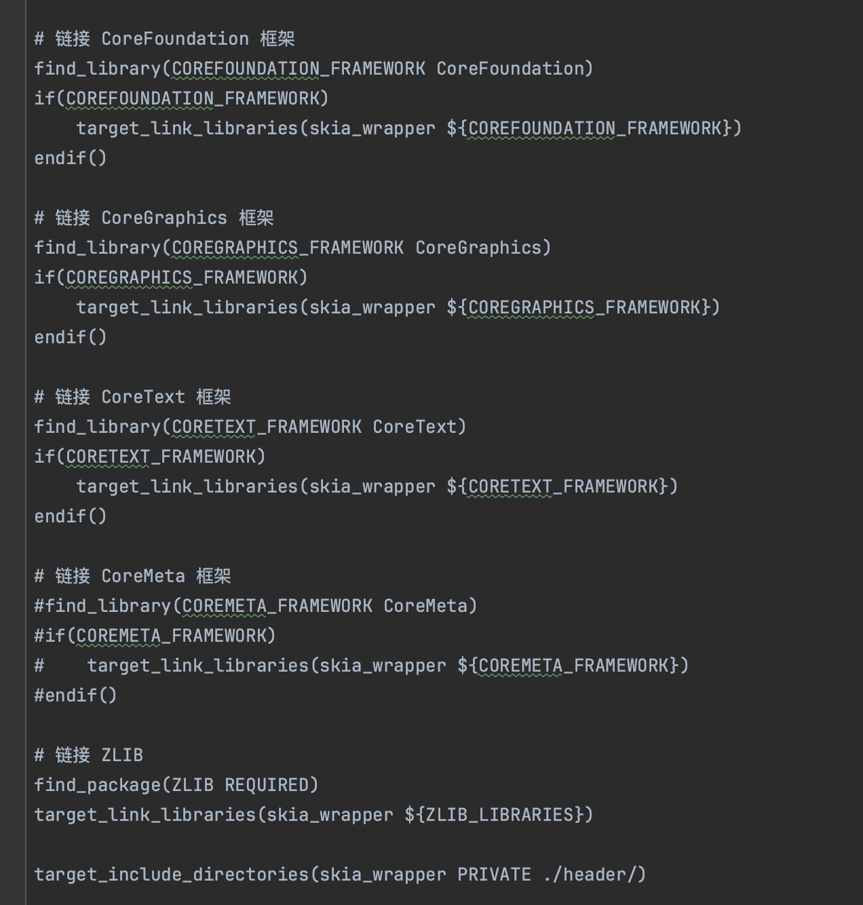

- 尝试在 macOS 上编译 skia
- 首先第一步从下载 github 下载 skia 的代码
- 按照官方文档 `https://skia.org/docs/user/download/`
- 下载源代码，并安装相关工具，主要是 gn 和 ninja：
- ```
  git clone 'https://chromium.googlesource.com/chromium/tools/depot_tools.git'
  export PATH="${PWD}/depot_tools:${PATH}"
  git clone https://skia.googlesource.com/skia.git
  cd skia
  python3 tools/git-sync-deps
  ```
- 然后就可以开始编译 skia 了，编译的时候有很多参数可以设置
- `is_official_build` 如果设置成 false 编译相当于 debug 版本，会带符号表，把第三方的依赖打包进去，会导致编译出来的文件特别大
- 还有一些可配置的第三方库入：libpng, libwebp, or libjpeg-turbo
- 先不管这些，直接编译：
- ```
  bin/gn gen out/Static --args='is_official_build=true'
  ninja -C out/Static
  ```
- 在这个编译的过程中，会碰到很多报错，比如：
- ` fatal error: 'jpeglib.h' file not found`
- 可能是系统的 libjpeg 库版本不对导致的，我们不需要 jpeg，直接关掉
- `bin/gn gen out/Static --args='is_official_build=true skia_use_libjpeg_turbo_decode=false skia_use_libjpeg_turbo_encode=false'`
- 继续编译后又报错：
- `fatal error: 'png.h' file not found
  #include <png.h>`
- 这个我们需要，所以不能直接关掉，好在有个配置可以让它不使用系统的 libpng `skia_use_system_libpng`
- `bin/gn gen out/Static --args='is_official_build=true skia_use_libjpeg_turbo_decode=false skia_use_libjpeg_turbo_encode=false skia_use_system_libpng=false'`
- 继续编译又报错了
- `fatal error: 'webp/decode.h' file not found`
- 同理设置 `skia_use_system_libwebp`
- `bin/gn gen out/Static --args='is_official_build=true skia_use_libjpeg_turbo_decode=false skia_use_libjpeg_turbo_encode=false skia_use_system_libpng=false skia_use_system_libwebp=false'`
- 又又又报错：`modules/skunicode/src/SkUnicode_icu.h:10:10: fatal error: 'unicode/ubidi.h' file not found`
- 这个 icu 不知道是什么东西，但是可以关掉 `skia_use_icu`
- `bin/gn gen out/Static --args='is_official_build=true skia_use_libjpeg_turbo_decode=false skia_use_libjpeg_turbo_encode=false skia_use_system_libpng=false skia_use_system_libwebp=false skia_use_icu=false'`
- 然后终于编译成功了
- 
- skia 的文档真是太少了，尤其是最新代码各种 bc，只能一边看 .h 文件，一边猜测
- skia 有个 c api，纯 c 的接口可以给 cgo 用，我试了一下发现这个 api 不全，缺少很多东西
- 而且最新的代码已经被删掉了，不得不吐槽这个 skia bc 的太频繁：
- 
- 所有只能自己写 c++ 代码了，实现方式：
- 1.c++ 写好渲染逻辑，导出 c 的 api，
- 2.编译成静态库
- 3.cgo 导入给 golang 用，golang 只需调用一个接口就可了
- skia 的逻辑其实写 Android 的会感觉很亲切
- 首先第一步是创建一个 Surface
- ```
  int width = static_cast<int>(round(req->width));
  int ascent = static_cast<int>(round(req->ascent));
  int descent = static_cast<int>(round(req->descent));
  auto info = SkImageInfo::Make(width,ascent+descent,SkColorType::kRGBA_8888_SkColorType,SkAlphaType::kPremul_SkAlphaType);
  auto surface = SkSurfaces::Raster(info); // 根据 info 给的信息创建一块内存区域用于绘制
  ```
- 然后获取 canvas
- ```
  auto canvas = surface->getCanvas();
  ```
- 然后再用 canvas 开始绘制需要的东西
- ```
  canvas->drawLine(SkPoint::Make(f.float_extra[0], f.float_extra[1]), SkPoint::Make(f.float_extra[2], f.float_extra[3]), paint);
  canvas->drawRect(SkRect::MakeXYWH(f.float_extra[0], f.float_extra[1], f.float_extra[2], f.float_extra[3]), paint);
  canvas->drawCircle(SkPoint::Make(f.float_extra[0], f.float_extra[1]),f.float_extra[2],paint);
  ```
- 画文字稍微复杂点，需要导入系统的字体或者指定字体，系统字体需要使用到系统的 api，比如 macOS 的 CoreText
- ```
  sk_sp<SkFontMgr> mgr = SkFontMgr_New_CoreText(nullptr);
  sk_sp<SkTypeface> mathFontTypeface = mgr->legacyMakeTypeface(mathFont,SkFontStyle());
  SkFont font;
  font.setTypeface(mathFontTypeface);
  font.setSize(static_cast<SkScalar>(f.paint.text_size));
  SkPaint paint;
  paint.setColor(mapColor(f.paint.color));
  paint.setStrokeWidth(static_cast<SkScalar>(f.paint.stroke_width));
  canvas->drawString(f.string_extra[0],f.float_extra[0],f.float_extra[1],font,paint);
  ```
- 最后再把 surface 的内容保存到文件，比如：
- ```
  SkPixmap pixmap;
  surface->peekPixels(&pixmap);
  SkFILEWStream fileStream(output);
  // 保存为 png
  SkPngEncoder::Options options;
  options.fZLibLevel = 6;
  SkPngEncoder::Encode(&fileStream,pixmap,options);
  ```
- 写好以后用 CMake 编译成静态文件
- CMakeLists.txt 文件要链接 CoreFoundation，CoreGraphics 等几个 macOS 的库
- 