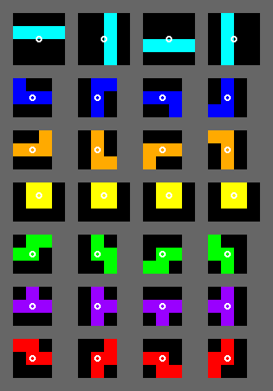
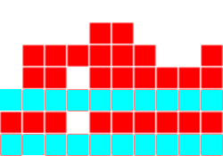
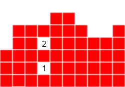
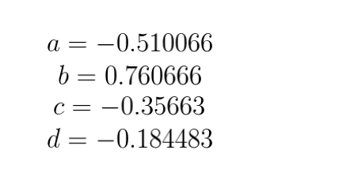

- 一个让俄罗斯方块自动消除的公式：https://codemyroad.wordpress.com/2013/04/14/tetris-ai-the-near-perfect-player/
- 首先一共有 7 种方块，“I”, “O”, “J”, “L”, “S”, “Z”, “T”
- 
- 要想让它自动选择最合适的线路落下，那就要定一个规则
- 计算方法是，随机产生一个方块在每一列落下以后形成盘面布局得出的总分
- 哪个得分最高就从那一列落下，不过还要加上每个方块有4个旋转方向
- 所以一共要计算 4 * 列数 次，取一个最高分
- 规则1: Aggregate Height，所有列加起来的总高度，这个值越低越好
- 
- 规则2:Complete Lines，可消除行数，这个值越高越好
- 
- 规则3: Holes，洞的个数，这个值越小越好
- 
- 规则4: Bumpiness，颠簸程度，就是相邻两的差值，这个值越小越好
- 
- 那么最后的公式是：
- a * (Aggregate Height) + b * (Complete Lines) + c *(Holes) + d * (Bumpiness)
- a,b,c,d 是 4 个常数，代表这四个规则对最终值的影响权重
- 
- 至于这4个常数是如何算出来的，文章后面写的说是用遗传算法
- 最后做出来的效果：https://leeyiyuan.info/tetrisai/