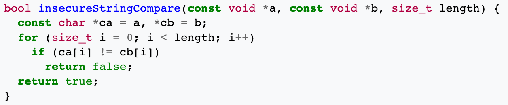
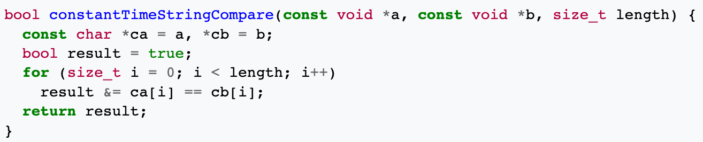

- 时序攻击(Timing Attack)，是指通过分析加密算法的执行时长来推导出密码
- 每一步操作都会消耗一定量的时间，攻击者可以利用时间差推算出正确密码
- 下面这个 Compare 实现乍一看没啥问题，但是可能会被时序攻击
- 比如用户密码是 123456，当攻击者最开始随机输入数字组合，比如 143223，233453
- 通过比对两次是发现第一个比第二个慢一点，因为第一个密码多执行了一次循环
- 重复上面的步骤最终能算出正确的密码
- 
- 为了避免被时序攻击，需要改造一下这个算法，不因为正确或错误影响执行时间
- 
