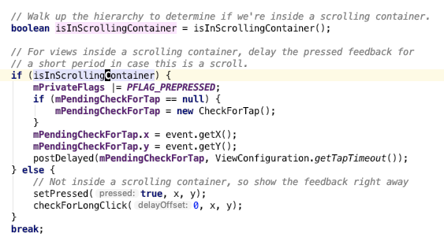

- 如果你不小心按下一个按钮，不想让它响应怎么做？
- 当然是划出按钮的范围啦，傻子都知道，对，但不完全，你得划出范围的一小段距离才被认定放弃
- 那系统怎么实现这种效果的呢？
- 首先注册点击事件是通过 `setOnClickListener`，看一下代码：
- ````
    public void setOnClickListener(@Nullable OnClickListener l) {
        if (!isClickable()) {
            setClickable(true);
        }
        getListenerInfo().mOnClickListener = l;
    }
- `getListenerInfo()` 是一个事件的集合，里面定义了很多事件，我们只关心 `OnClickListener`
- 然后谁会触发 `OnClickListener`，那肯定是响应事件的第二站：`onTouchEvent`
- 果然，在它的 ACTION_MOVE 这一个判断里有这么一段代码：
- ````
  if (!pointInView(x, y, mTouchSlop)) {
      // Outside button
      // Remove any future long press/tap checks
      removeTapCallback();
      removeLongPressCallback();
      if ((mPrivateFlags & PFLAG_PRESSED) != 0) {
        setPressed(false); // 刷新 Button UI 状态
      }
      mPrivateFlags3 &= ~PFLAG3_FINGER_DOWN; // 将 FLAG 标记为未点击
  }

  public boolean pointInView(float localX, float localY, float slop) {
      return localX >= -slop && localY >= -slop && localX < ((mRight - mLeft) + slop) &&
            localY < ((mBottom - mTop) + slop);
  }
- 上面那个 slop 就是滑出按钮当范围，默认是范围是读取系统配置的 TOUCH_SLOP
- ~你也可以重写 pointInView 这个方法告诉 View 是否滑出点击范围~
- 更正：不能重写这个方法，被系统注释为 @hide
- 本次查看代码还有一个意外收获
- 
- 当一个按钮在一个滑动容器当时候，当你按下不会马上响应点击状态，因为系统可能会怀疑用户想要滑动而非点击，延迟 100 ms 后如果发现没有滑动才响应点击效果