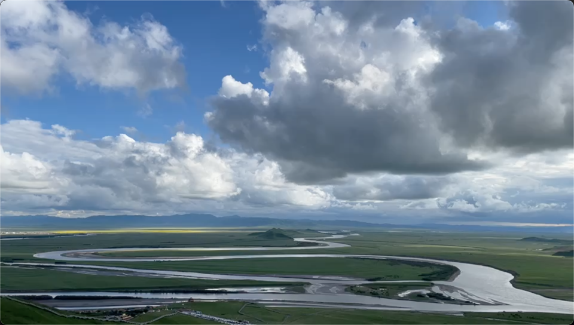

- 上周末去了若尔盖，早上 6:00 出发，下午 5 点多才到，导航写的 8 个多小时（还有一次说6个小时），结果用了 11 个小时，然后晚上开始头疼（涨的那种疼），恶心，拉肚子，还好宾馆有氧气瓶，赶紧买了几瓶吸上，吸完过几分钟症状就缓解了，所以去的时候一定要做好充足的准备，提前吃抗高反的药，多备氧气瓶，这个是万能的，据说药物对有些人不起作用，再就是别乱跑，能不动就别动😂，本来第二天说要去花海也没去，一大早就溜了，降到海拔 2000 多米就好了
- 还要常说的抗高反药物红景天，这个回答说没有用，还是去买正规的西药，乙酰唑胺，醋甲唑胺 之类的，但是可能会有过敏反应
- https://www.zhihu.com/question/21087460/answer/108784335
- 风景还是不错的
- 