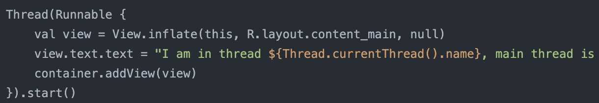
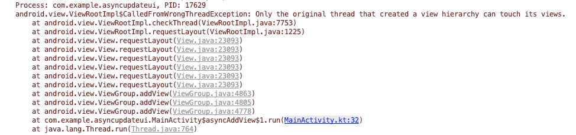
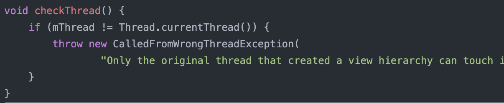
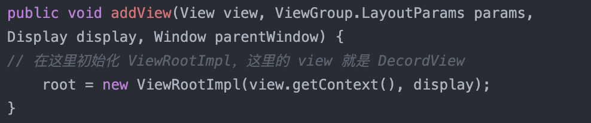
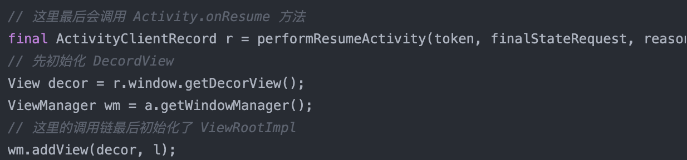
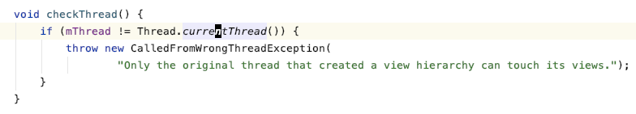
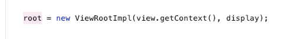

- 开始接触 Android 的时候，最先学到的就是 Android 只能在主线程操作UI，所以下面这段代码：
- 
- 如果把它放在 Activity.onCreate 里执行，按照常理，它应该会崩溃报错，但是实际运行你会发现，它居然没有报错，正常显示，即便是放在 onResume 里，它也不会崩溃！
- 但是如果让这线程 sleep 一秒再去运行，就出现了熟悉的崩溃：
- 
- 为什么会这样呢，根据错误提示找到报错的位置是在 ViewRootImpl 里面
- 
- 也就是说这个 ViewRootImpl 会检测操作 UI 的线程，所以猜测可能在 onCreate 方法执行时 ViewRootImpl 还没有初始化
- 通过在它的构造方法打一个断点，发现它在 WindowManagerGlobal 里初始化的
- 
- 而调用这个方法的类是 ActivityThread.handleResumeActivity(...)
- 
- handleResumeActivity 方法执行里几个主要操作
    1. 回调 Activity 的 onResume 方法，
    2. 创建 DecordView，也就是根 View
    3. 生成 ViewRootImpl 并开始渲染。

- 所以，最上面看起来是在其他线程更新 UI，但其实这个时候 UI 还没有开始渲染，不能算
- 但是，如果你有一个很大的 xml 加载比较费时间的，可以先在其他线程加载好，再通过主线程更新到 UI
- 2020-06-01 补充
- Android 的 UI 线程并不是通常意义上的主线程，而是创建 根 View 的线程
- View 树的树根检查 thread 是，当前线程比对的是创建树根时的 Thread
- 
- WindowManagerGlobal.addView 创建的 ViewRootImpl
- 
- 所以理论上，只要在其他线程创建一个新的 View，那么以后对 View 的修改就可以异步线程修改
- 比如在一个自定义的 HandlerThread 创建一个 Dialog，那以后对 dialog 的操作就只能在这个 HandlerThread 进行
- 那这样岂不是就绕开了 ANR 的检查？
- 看了一下上次说的那个 ANR 监测的库，它只检测了 MainThread 的 Handler 是否阻塞，所以理论上这样确实可以绕过 ANR，但是 UI 看起来还是卡住了的