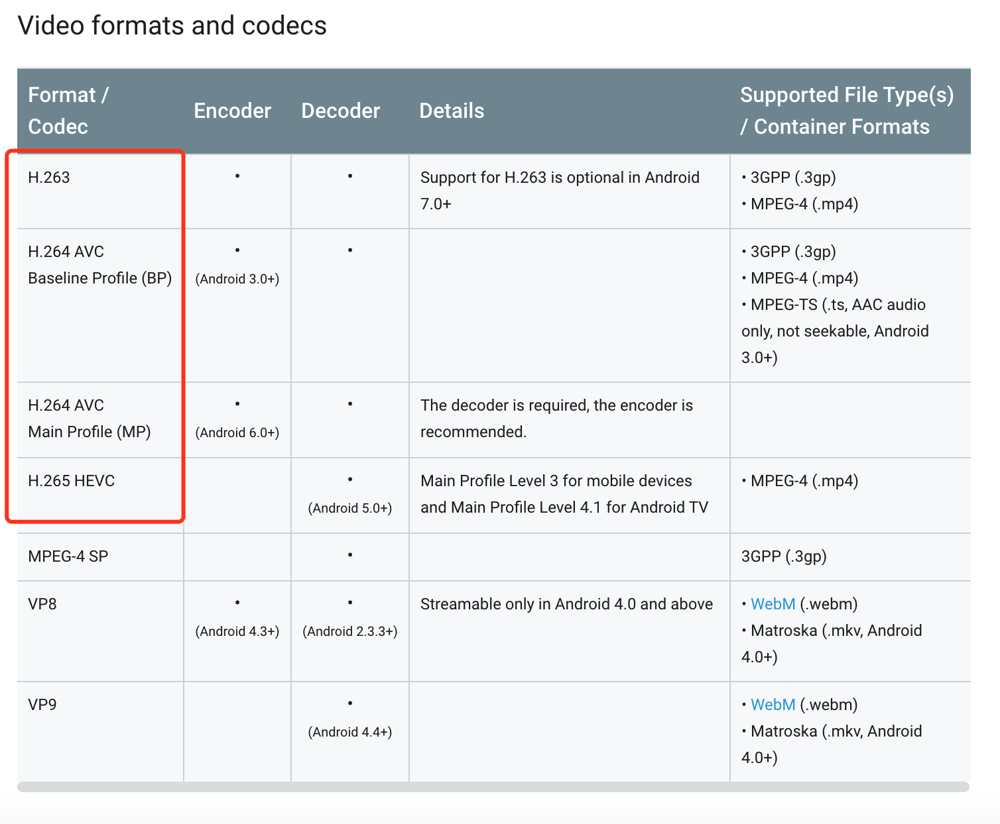
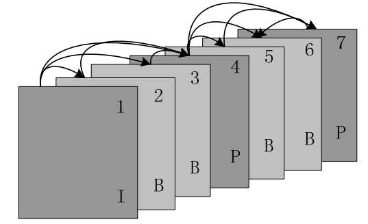
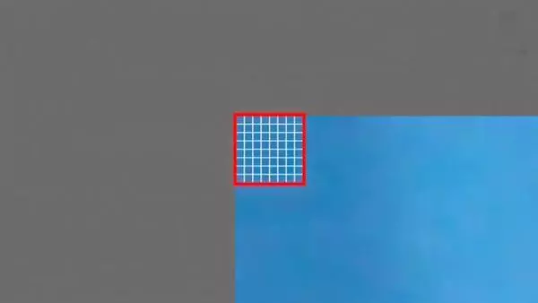
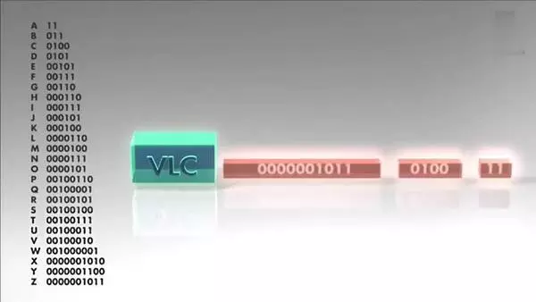

- 现在视频文件最常见的格式是 mp4，但是在看 Android 播放器支持的视频格式时发现没有直接说支持 mp4，而是这样的，于是简单的了解了一下
- 
- mp4 是一种文件类型，是一种视频，音频，字幕等的组织形式，可以理解为一个容器，类似的文件格式还有 mkv，avi 等
- 而图片中圈起来的部分是视频的压缩格式，比如 H.263/H.264/H.265 等都是，据说早期还收取专利费
- H.263 出来的最早，对应的 mime 是 video/3gpp
- H.264 是 2004 年发布的规范，全称是 Advanced Video Encoding，也叫 MPEG-4 AVC，相对于 263 压缩率提升 40-50%，最高支持 4K 视频，mime 是：video/avc，是目前最常用的视频编码格式
- H.265 是 2013 年发布的规范，全称是 High Efficiency Video Encoding，为了支持更高清的视频和更高的压缩率， mime 是：video/hevc
- 然后视频在播放时要将压缩的视频还原成每一帧的画面，更高的编码意味着解码时需要更多的计算，如果使用软解码就需要程序通过 CPU 通过复杂的计算进行还原，俗称软解码
- 硬解码是指通过 GPU 中设计的特殊电路直接能将某种压缩的视频还原成画面，不需要通过 CPU 的计算

- 简单的看了一下视频压缩原理，视频压缩主要有两个纬度
  - 1. 第一种在单个帧内处理，降低每一帧画面所占空间，比如裁剪画面尺寸和压缩画面质量，原理和 jpeg 图片压缩一样
  - 2. 第二种是通过时间线的方向处理多帧数据，比如当前帧和下一帧大部分画面都一样，那么就可以把这一帧作为关键帧，再记录下一帧和这一帧的差异信息，然后在播放时就可以通过当前帧和差异信息还原下一帧的画面
- 
- 实际情况比这个复杂的多，比如会把一帧的画面按照一定的单元拆分成多个小格子来对比差异
- 
- 还有什么运动估计和补偿
- 
- CABCA 给高频数据短码，低频数据长码
- 