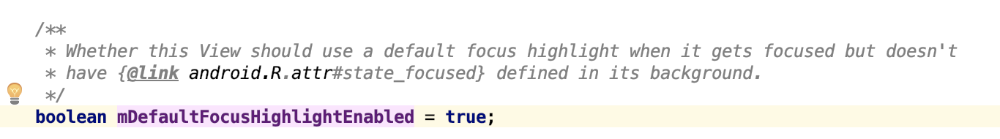

- 之前碰到一个问题，有些 View 特殊情况下会显示一层灰色背景，而且不占用 Background，猜测可能是获取焦点后默认显示的一个高亮，
- 然后去看了一下 View 的源码
- 在 View 的 draw 方法里看到它会根据一些条件判断是否需要绘制焦点高亮
- 
- 最开始想的是直接把默认的高亮设置为 null 即可
- 
- 但是看了一下是个私有方法，然后发现直接有一个开关可以控制
- 
- 它提供了 xml 和 Java 配置的接口，但是最低版本是 26
- 在布局中直接设置 `android:defaultFocusHighlightEnabled="false"` 即可
- 但是如果想整个应用禁用的话，不可能给每一个 View 增加这个属性，
- 在 Style 里找了一下果然也有这个属性，完美～