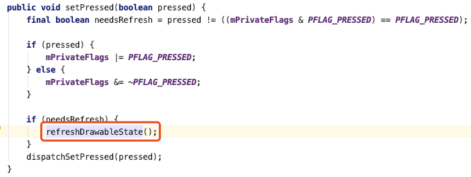
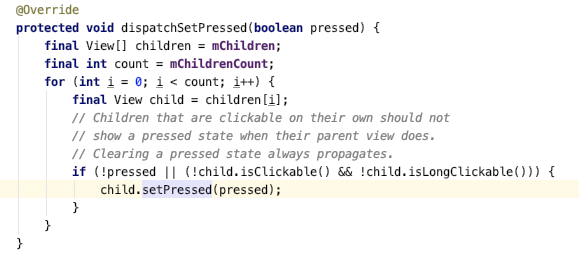
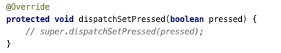

- View 被点击时它的 Drawable 的点击状态切换是通过 View 内部 setPressed 的 refreshDrawableState
- 
- 但是它这个方法同时又调了 dispatchSetPressed
- 
- 它会遍历子 View ，然后只要这个子 view 不可点击且不可长按，就通知这个子 view 也刷新点击状态
- 于是就会出现下面视频这种现象，点击父 View 的位置
- 解决办法重写 dispatchSetPressed 不让它触发子 view 点击状态的变化
- 