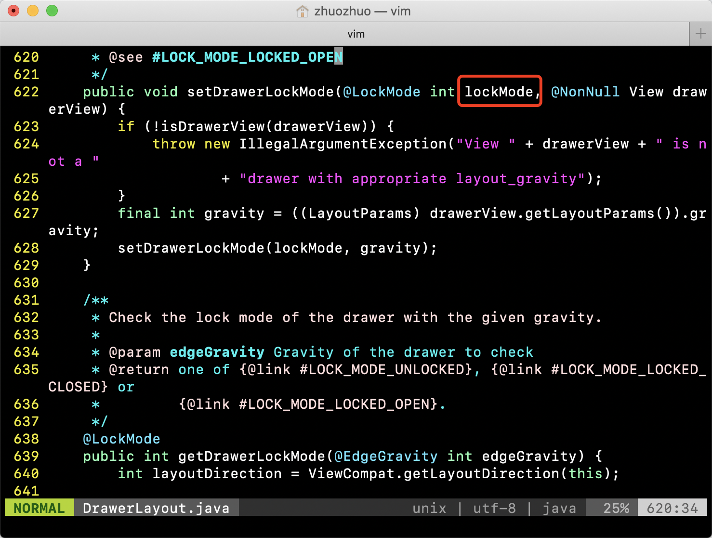
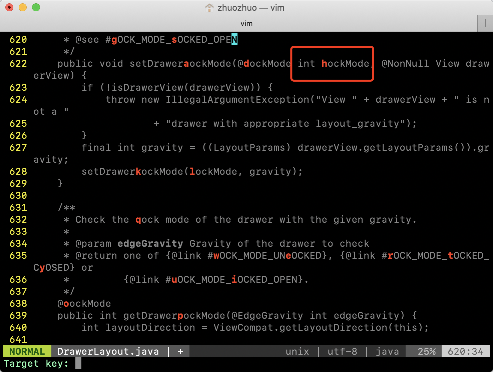

- 今天试了一下 vim 的一个扩展插件 vim-easymotion
- 它的作用是帮你快速切换光标的位置，一般使用 vim 切换光标围追，只能通过
- 上一行，下一行，上一个单词，下一个单词，切换到 XX 行，find 等命令
- 总体来说都是按照一定的规则去切换，find 稍微好一点，但是如果 find 到多个，还是要一个一个的切换过去
- easymotion 应该算是对 find 功能的扩展，
- 首先使用一个或两个字母匹配到你要定位的位置，这个时候一般会匹配到多个
- 比如这个页面又很多个 lock，我想快速定位到方法参数那个 lock
- 
- 首先按下 s 触发 easymotion 模式（默认的触发方式是 \\s），再按下 lock 的前两个字母 lo，它就会显示出当前屏幕上所有的包含 lo 的单词
- 
- 并且会用一个唯一的 1-2 个字母的 key 代替，上图中我想要定位的那个地方是 h
- 只要按下 h 就会跳到那个位置
- 这玩意还有很多个功能，看的头大，但是好像核心功能其实就是这个，感觉这个就够用了