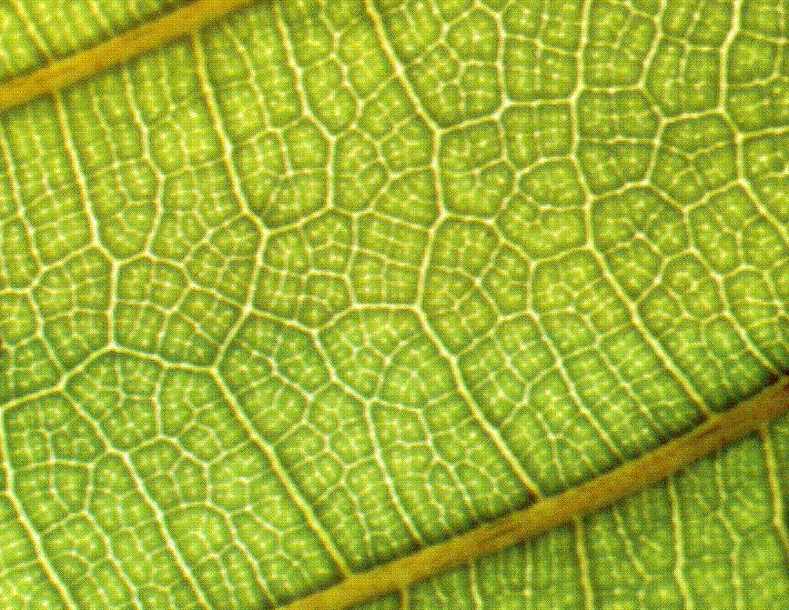
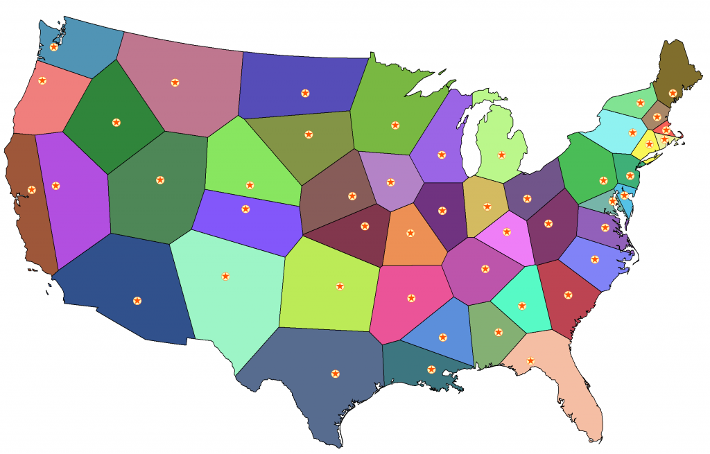

- 沃罗诺伊图（Voronoi diagram）
- 是一种有生命的图，平面上的一些离散的点不断扩张，相互挤压形成的一种自然图形
- 静态的图大概是这样的
- 
- 生长过程是这样的
- 
- 这个图的特征是，任意亮点，边到两个点的距离相等
- 这种图形在自然界中非常普遍，比如树叶中，由于养分都是送到特定的点，所以树叶的生长都是按照某些点进行扩散的，所以就形成了这种图案
- 
- 突然有个想法，把中国地图，按照每个省会为一个点，每个省的范围是什么样的，在网上找了找居然没有人做过
- 放一张美帝的
- 